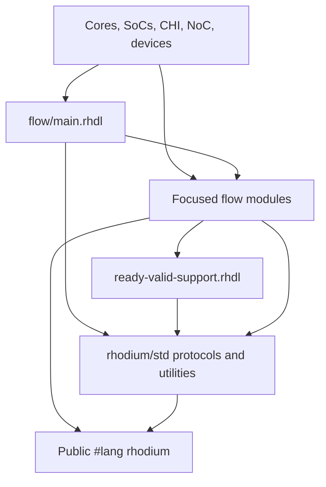

<!-- Defines flow library ownership, dependency boundaries, and focused validation. -->
<!-- SPDX-License-Identifier: Apache-2.0 -->

# Developing the flow library

Read [README.md](README.md) for public contracts and the repository
[DEVELOPING.md](../DEVELOPING.md) for contribution rules. This package owns
streaming components and their configured topology stages, not language syntax.

## Dependencies and ownership

Arrows mean “uses.” Keep the dependency direction one-way:



- `main.rhdl` only aggregates exports. Keep each family independently importable.
- Focused modules own circuit state, handshakes, routing, arbitration, and
  protocol conversion. `ready-valid-support.rhdl` owns shared source
  normalization and configured-stage type information.
- `rhodium/std` retains the nominal ready-valid, credited, and flit definitions,
  counters, shift registers, and generic reductions. Re-export existing types;
  do not duplicate their declarations. Standard-library modules must not import
  `flow/`, including its facade.
- Use the public language and approved `rhodium/std` modules only. Do not import
  compiler implementation, analysis, backend, formal, or downstream domain code.
- Generic interfaces, `InterfaceHandle`, `InterfaceTransformResult`, connection
  checks, and topology metadata belong to the frontend. Flow implements stages
  through those public mechanisms, not its own graph or IR.
- `event.rhdl` owns transparent checkpoint adapters and publishes public
  metadata. Analysis and runtime instrumentation stay in `rhodium/event`; flow
  must not import that package.
  Missing ancestry is reported by the consumer's partial mode. Its `trace_edge`
  helper records a named retained-state causal relation through the frontend;
  it must not add functional wiring or move analysis into `flow/`.
  Checkpoint `~parents` and late `trace_parents` forward existing annotated
  endpoints to the same frontend selection metadata; backward path discovery
  and shadow transport remain compiler-owned. Both checkpoint protocols support
  `~when` without changing functional transfers.
- `offer-decoupled.rhdl` owns best-effort Valid-to-Decoupled wiring;
  `to-decoupled.rhdl` retains the checked same-cycle acceptance contract.
  Keep fault/replay policy downstream. Event qualification in `event.rhdl`
  changes only the observed valid predicate, never functional protocol wiring.

The exact direct-import inventory lives in
[`rhodium/DEVELOPING.md`](../rhodium/DEVELOPING.md#flow-library-dependencies).
Update it for every import change. The repository
[boundary checker](../tools/check-boundaries.sh) enforces library imports,
reverse-dependency restrictions, and inventory coverage.

## Changing a component

`queue.rhdl` owns pointer-based FIFOs; `shift-queue.rhdl` owns shallow
fixed-head FIFOs. Keep their handshake options equivalent without changing
the storage architecture of existing `Queue` consumers. The `shift-queue`
backend fixture checks both implementations against a transaction scoreboard.
It also compares configured `shift_queue` stages with explicit instances.
The configured stage uses the common source normalization and dependent
topology result contract; do not attach pointer-queue lineage metadata to
shifted storage. Its intrinsic retained-window contract samples the head-valid
bit, registered count, actual store/removal, optional empty bypass, and explicit
flush. The `event-frontend` scoreboard exercises traced flow-through storage
and cancellation; `shift-queue` covers all handshake options and depths.

1. State the public type, timing, reset, handshake, priority, and invalid-input
   contract in README. Keep application-specific routing and policy downstream.
2. Choose a focused module. Use an inline transform when no additional state
   or hierarchy is needed; use a named generator for state and explicit ports.
3. Preserve public APIs and nominal protocol identity. Add an export to the
   facade only when it belongs to the streaming family.
4. Validate host parameters during elaboration and test observable behavior
   using existing focused simulations. Do not add an elaboration snapshot for
   every circuit. Host tests are for static information, pure host policy,
   protocol compatibility, or meaningful invalid uses.

## Protocol preservation

Keep trace semantics with the implementation. Primitive modules declare
`describe_interface_contract` using local controls; configured adapters describe
their child for presentation without supplying a second model. Inline adapters
use `describe_interface_transform(..., ~trace_model: ...)`. These share one
frontend contract model and occurrence-aware event analysis. Name control
declarations when a module contains multiple independent regions. Do not
summarize composite modules across internal checkpoints or contracted children.
See the [interface API](../rhodium/frontend/layers/README.md) for validation rules.

The event pipeline, elastic, queue, arbiter, and broadcast fixtures exercise
direct instances against configured reference lanes, actual control sampling,
and traversal through presentation wrappers. Keep those behavioral checks when
changing how contracts are attached; elaboration alone does not establish
reset, simultaneous-transfer, or backpressure correctness.

`ValidArbiter` certifies its actual one-hot grants without introducing readiness
or retaining losing occurrences. Its configured adapter delegates to that
intrinsic contract. The `rv5stage-fetch-source` fixture checks nested Valid
selection through replay/restart replacement and held cursor feedback.
Both fixed-priority payload arbiters also certify pending-offer selection:
their grants select the displayed payload independently of downstream readiness.
This preserves stalled ancestry after merges without promising stable Decoupled
offers or changing hardware.

`OfferRegister` owns its retained trace contract. Capture on every update;
release the old owner on occupied replacement or accepted output, with capture
taking priority. Do not require acceptance before replacing a stalled offer.
`event-offer-register` checks exact parents through replacement, simultaneous
delivery/update, drain, and reset. RV5Stage's core CMO/WRS fixtures check reuse
under completion gating and ownership-selected arbitration.

`GrantDemux` and `GrantMerge` own routing and selection contracts sampled from
their functional grants. `GrantCrossbar` and its configured adapter delegate
through these children; do not add a competing whole-crossbar model.
`event-crossbar` checks direct/configured traversal through input queues,
simultaneous outputs, changing grants under stalls, and reset with pending work
against a public-transfer occurrence scoreboard.

Keep protocol declarations separate from components that implement them.
Ready-valid transforms must preserve or deliberately weaken the nominal
contract documented in the README. A transform that observes live ambient
hardware cannot claim `Irrevocable` stability unless the caller makes the
explicit stable-function promise already used by `map_flow` and
`demux_flow`.

Treat control-only interfaces as their own member shape. Do not manufacture a
dummy payload or infer that any interface with `valid` and `ready` is a
`DecoupledCtrl`. Keep credited transport's accounting at explicit adapter
boundaries; ready-valid components between those boundaries should not grow
credited variants.

For configured pipeline stages, preserve linear handle and sink behavior. Each
application of a reusable configured function must elaborate fresh wiring and
state. Cardinality-changing stages must describe their exact endpoint-array
result rather than falling back to an untyped host array.

## Static information and topology results

The public flow syntax relies on the frontend interface layer's
`InterfaceTransformResult(source, connected)` dependent result annotation.
Configured stage functions use it to preserve the result shape selected by the
source:

| Source known at expansion time | Result information |
|---|---|
| Concrete endpoint | The connected far-end endpoint surface |
| Concrete endpoint array | The transform's endpoint or endpoint-array surface |
| Payload or interface type seed | A complete disconnected handle |
| Existing handle | A handle extended by the new stage |
| Generic topology expression | A conservative endpoint, array, or handle surface |

Keep shared ready-valid classification in
[`ready-valid-support.rhdl`](ready-valid-support.rhdl). Its
`FlowSource` annotations and protocol-normalization helpers are the common
entry point for configured stages. Individual stage modules should specify
only their connected result shape with `InterfaceTransformResult`.

Use the `FlowSource.to_ready_valid_protocol`, `.to_valid_protocol`, and
`.to_control_protocol` converter annotations for local protocol bindings.
Converters must stay thin wrappers over the canonical helpers so diagnostics
and nominal protocol checks have one owner. Never convert the configured stage
parameter itself: retain the original endpoint, handle, or type seed for
`finish_interface_transform`. Heterogeneous endpoint arrays remain explicit
per-element normalization because their shape is contextual.

Single-source operators with inline payload binders use
`immediate_callee.macro` to receive the left operand's static information.
Resolve only the `bits` member through `flow_payload_static_infos`, then bind
the body through `flow_payload_body`. Missing source information must select
the ordinary binder path; runtime protocol normalization remains authoritative.
Do not expose or inspect interface-layer static-information keys from Flow.
Array-valued or heterogeneous sources need an explicit per-element contract
before they can use this pattern safely.

When adding or changing a configured stage, extend
[`std-flow-static.rhdl`](../flow/tests/std-flow-static.rhdl) and its
loader test so `use_static` covers direct endpoint fields, endpoint-array
indexing or destructuring, disconnected handle sides, and reuse where
applicable. A runtime elaboration test alone cannot catch lost expansion-time
field information.

## Validation and existing test locations

The extraction retains the current test and example locations and runner
names. Compiler-facing composition and static-information tests remain in
[`tests/`](tests/); executable flow examples remain in
[`examples/std`](../examples/std/). The `std` backend group and `examples-std`
target cover both foundational standard modules and flow.

Use the persistent worktree-specific compiled root required by
[`AGENTS.md`](../AGENTS.md#verification). The wrappers select it when omitted:

```sh
tools/run-racket-tests.sh flow/tests/std-flow-test.rhm flow/tests/std-flow-chain-test.rhm flow/tests/std-flow-static-test.rhm
make examples-std
make check-boundaries
bash tools/check-ci-changes.sh
```

For cycle-visible behavior, select the relevant existing fixtures:

```sh
FIXTURES='queue-options shift-queue rr-arbiter packet-rr-arbiter selective-atomic-fork selective-join state-flow' bash tools/testing/circt/run.sh
```

The [backend guide](../tools/testing/circt/README.md) owns fixture selection and
toolchain requirements. Credited, flit, control-only, valid-only, and event
fixtures provide additional coverage when those contracts change.
Use `make ci-circt-std-test` for the complete shared library backend group.
Use `FIXTURE=event-offer bash tools/testing/circt/run.sh` for best-effort offer
conversion and qualified transfer/stall lineage; its scoreboard checks exact
current-attempt parents, rejected/replayed offers, reset, and unchanged wiring.
Preserve example-owned Verilog references unless generated hardware changes
intentionally; a path migration should not require new references.

When adding or moving source, update the dependency inventory and ensure
[`tools/ci-changes.sh`](../tools/ci-changes.sh) selects affected consumers.
Compilation discovers flow transitively through the existing test and example
entrypoints; source annotation hygiene covers the repository root. Do not add
a second source manifest or silently drop downstream coverage.

## Queue construct boundary

`queue.rhdl` owns `QueueConstruct`, its signature dependency function, and
`QueueExpansion`. Its `implementation` block contains the existing RTL and
implementation-specific trace controls. Keep the declaration conservative and
sound across all pipe/flow options; preserve payload dependencies on invalid
cycles as well as accepted transfers. The portable provider maps state and
named assertions through public core helpers exposed by the language.

`tests/retained-queue-test.rhm` compares declared and actual dependencies across
depths/options/payload shapes and checks direct/configured identity, deferred
selection, portable effects, and per-occurrence choice with shared modules.
Use `queue-options` and `event-queue` CIRCT fixtures for cycle-visible RTL and
trace preservation. Native simulation and its differential suite remain with
the consuming simulator.

## Map construct boundary

`map.rhdl` uses the frontend payload hook to extract one typed computation per
mapping occurrence. It owns `MapConstruct`, the live operand and dependency
contract, and `MapExpansion`'s scoped composition. Reuse the normalized payload
value for both the explicit argument and the inline binder; reading an endpoint
projection twice would incorrectly capture its containing interface instead.
Default elaboration keeps direct assignments. Preserve invalid-use diagnostics
and stable protocol behavior when changing this macro.

Run `tests/retained-map-test.rhm`, the flow-chain/static regressions, and the
`retained-flow-map` CIRCT/Verilator fixture. The latter materializes the canonical
record-mapping example and changes its captured tag while stalled and invalid.
Native differential execution belongs to the dependent simulator suite.

## Pipe construct boundaries

`pipe.rhdl` owns distinct nominal identities for elastic payload pipes,
valid-only pipes, always-capture valid pipes, and control-only pipes. Shared
signature construction declares synchronous state and the elastic backward-ready
dependency. Declare optional flush ports before deferring the body; keep all
register construction and implementation-specific tracing inside the body.
The exported providers bind each portable body's state to its declared effect.

Run `tests/retained-pipe-test.rhm` for skipped-body selection, actual versus
declared dependencies, and portable materialization. Backend
`materialize-pipe-test.rhm` compares authored module names and normalized CIRCT
across stages, payload shapes, and flush options. Existing pipe, control-pipe,
valid-pipe, and always-capture fixtures own observable RTL behavior and references.
Native execution remains a separate consumer validation gate.
