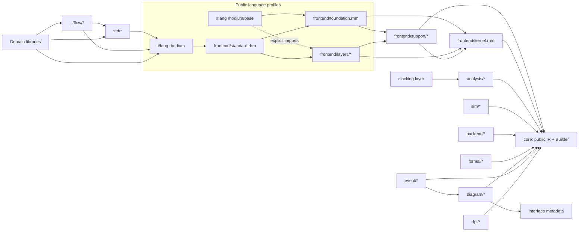

<!-- Defines the Rhodium implementation package graph and contributor dependency contract. -->
<!-- SPDX-License-Identifier: Apache-2.0 -->

# Developing Rhodium

Read the package [`README.md`](README.md) first for its public profiles,
interfaces, and consumer-facing package map. This guide owns Rhodium's
implementation boundaries and direct-dependency contract. For repository-wide
development setup and workflow, see the project [`DEVELOPING.md`](../DEVELOPING.md).

Rhodium has one backend-independent hardware model and several authoring
profiles. Existing frontend paths elaborate into public core module IR. Core
also owns a retained composition level for selective implementation lowering;
frontend syntax is not a second IR. Its staged integration is tracked in the
[selective lowering plan](core/SELECTIVE_LOWERING_PLAN.md).

## Implementation architecture

Arrows mean "may depend directly on." They point inward toward the public IR;
no reverse dependency is allowed.

`#lang rhodium` is the curated language. `#lang rhodium/base` is the composition
profile: it exposes the foundation and allows a program to import only the
language layers it wants. The word *base* names the public profile; the
internal module implementing its shared frontend forms is called the
*foundation*. The frontend guide explains
[profile selection and elaboration](frontend/README.md).

The frontend kernel's optional semantic expansion hooks depend only on core
`SemanticNode` records. The interface layer exports transform descriptions
through those hooks; no simulator or backend dependency is introduced. See the
[retention implementation guide](frontend/DEVELOPING.md#layered-semantic-retention).

The frontend kernel also imports the core construct contract and leaf-path
APIs. The foundation exports the core construct declaration records and
`bind_core_implementation` through the public language, so libraries can supply
portable implementations without importing compiler internals.

The core construct, composition, selection, and materialization modules use
core APIs and dependency-neutral support annotations. Composition consumes core verification and dependency
summaries; selection consumes construct/composition contracts. Expansion and
target-lowering providers are supplied by callers, never imported from libraries
or simulator packages by core. `materialize.rhm` uses Builder and verification
to produce a new owned design and source-object maps, without frontend or
backend imports. Core `metadata.rhm` calls the remapping protocol declared in
`ir.rhm`; interface and sync owners implement it through their existing core IR
imports. No core dependency on frontend or event code is introduced.

## Dependency rules

- Core never imports analysis, frontend, backend, or RFPL code.
- Analysis consumes completed core IR and does not import authoring or lowering
  packages.
- Frontend code never imports a backend. Frontend layers do not import sibling
  layers; reusable cross-layer machinery belongs in `frontend/support/`.
- Backends and formal tools consume verified core IR without importing
  frontend syntax or elaboration.
- Standard, flow, and domain libraries use the public language rather than
  Rhodium implementation modules. Flow may depend on std, but std and Rhodium
  implementation packages must not import flow. Flow must not import downstream
  domain libraries.
- RFPL and diagram generation are downstream views. They inspect public IR but
  do not participate in hardware construction.
- SoCs do not depend on simulators. Simulation and VLSI integration depend
  inward on public SoC, backend, SRAM, and harness surfaces.
- SRAM mapping consumes post-CIRCT MLIR. Rhodium implementation packages and
  SoCs do not import it, and generic mapping code owns no foundry policy.

## Package responsibilities

| Area | Responsibility | May depend directly on |
|---|---|---|
| [`../support/annotations.rhm`](../support/annotations.rhm) | Dependency-neutral Rhombus refinement annotations | Rhombus only |
| [`core/`](core/README.md) | Types, module and retained composition IR, Builder, verification, selection, and printing | Other core modules, `../support/annotations.rhm`, and Rhombus libraries |
| [`analysis/`](analysis/README.md) | Optional certification, provenance, and diagnostic passes over completed public IR | Core and other analysis modules |
| [`frontend/kernel.rhm`](frontend/kernel.rhm) | Context-sensitive elaboration, deferred frontend hardware values, and scoped payload capture | Core, including `core/capture.rhm` |
| [`frontend/support/`](frontend/support/) | Shared cross-layer protocols, macros, static-information machinery, and policy certification; not a language profile | Kernel, approved core APIs, approved analyses, other support modules |
| [`frontend/foundation.rhm`](frontend/foundation.rhm) | Circuits, ports, connections, elaboration, basic types including `Bool`, extension-defined hardware type declarations and protocols, receiver-owned scalar membership and width extension, selection, and representation methods | Kernel, support, core type and construct/composition APIs |
| [`frontend/layers/`](frontend/layers/README.md) | Independently selectable notation and abstractions over existing semantics | Kernel, support, approved core APIs and analyses |
| [`frontend/standard.rhm`](frontend/standard.rhm) | Aggregation only; defines no feature behavior | Foundation and all standard layers |
| [`language.rhm`](language.rhm), [`base/language.rhm`](base/language.rhm) | Compose ordinary Rhombus host control with one public Rhodium profile | Standard or foundation |
| [`../rfpl/`](../rfpl/README.md) | Physical views over existing modules: opaque hard macros and wiring-only composite floorplans with contained child coordinates | Public core IR only |
| [`diagram/`](diagram/README.md) | Read-only logical block, hierarchy, compound-interface, and flow visualization with JSON and DOT output | Core IR and interface-owned nonsemantic metadata |
| [`event/`](event/README.md) | Static dependency inference, immutable metadata/DPI instrumentation, and manifest/descriptor generation | Core IR, Builder, verifier, logical diagrams, other event modules, and Racket JSON string encoding |
| [`../rheg/`](../rheg/README.md) | Independent C++ event collector, manifest-bound snapshots, and streaming/standalone Perfetto export | Runtime: C++ standard library only; exporter: runtime and private nlohmann JSON dependency |
| [`std/`](std/README.md) | Optional host utilities, protocols, and circuit generators written in ordinary Rhodium | Public `#lang rhodium` authoring surface only |
| [`../flow/`](../flow/README.md) | Streaming buffers, arbitration, routing, packet adapters, and configured topology stages | Public `#lang rhodium`; focused `std/` modules; other flow modules |
| [`backend/`](backend/README.md) | Consume verified public IR; currently lower it through CIRCT | Core only |
| [`formal/`](formal/README.md) | Optional Rosette-backed behavioral equivalence, output reachability, and combinational output properties over verified public IR | Core only; Rosette through one Racket interoperability module |
| [`../chi/`](../chi/README.md) | AMBA CHI flits, links, monitors, fabric metadata, coherent Homes, shared memory control, single-beat subordinate transactions, and cache maintenance | Public `#lang rhodium`; protocol-neutral `std/` libraries and root-level `flow/`, including `std/ready-valid.rhdl` for Home snoop-target tracking and the single-beat subordinate engine, `std/bits.rhdl` and `flow/main.rhdl` for service matching, shared memory control, and maintenance, and `std/read-write.rhdl` and `std/sync-ram.rhdl` only for the concrete RAM backend within the memory stack |
| [`../socs/`](../socs/README.md) | Concrete system composition and end-to-end integration | Public domain-library and core surfaces only |
| [`../sims/`](../sims/README.md) | Executable SoC harnesses, FESVR host model, target payloads, and simulator bindings | Public SoC, CHI, flow, device (`devices/uart-dpi.rhdl`), and Rhodium surfaces; backend emission; optional event instrumentation and RHEG export; external C++ libraries |
| [`../sram/`](../sram/README.md) | Technology-independent post-CIRCT memory-site selection, macro-interface adaptation, tiling, and manifests | CIRCT/MLIR libraries; technology catalogs beneath `sram/` |
| [`../riscv/rtl/`](../riscv/rtl/README.md) | Converts RISC-V instruction encodings into generic typed decode patterns | Pure RISC-V model; public `#lang rhodium` libraries |
| [`../hardfloat/`](../hardfloat/README.md) | Rhodium port of Berkeley HardFloat representations and floating-point units | Public `#lang rhodium` authoring surface only |
| [`../vlsi/`](../vlsi/README.md) | Physical-design integration, design/technology policy, and mapped simulation | Public authoring/backend surfaces; `sram/`; `sims/`; external VLSI tools and harnesses |

The event compiler and RHEG exchange generated descriptors and fixed DPI calls;
neither imports the other's implementation. Event inference consumes generic
interface metadata, not `flow` library implementation modules.

CHI consumers in cores, devices, SoCs, and simulators depend directly on the
defining CHI modules and on `std/interconnect.rhdl` for generic address/transfer
types. The compatibility facade is not a production dependency boundary; the
[CHI import guide](../chi/README.md#package-boundary-and-import) and its
developer implementation map identify the owners.
CHI's `protocol/`, `transactions/`, `home/`, `subordinate/`, `adapters/`, and
`noc/` directories refine that source ownership without changing package
dependency direction. The CHI boundary checker audits nested production files;
the pure `chi/noc/noc-authoring.rhm` bridge still imports only host NoC/support
modules, not Rhodium or CIRCT.

HardFloat is representative of an external domain library over the public
language: Rhodium implementation packages do not depend on it, while its tests
may consume a backend to validate ordinary lowering.

## Design commitments

- Keep one public hardware IR until a concrete feature requires another.
- Keep frontend conveniences out of core when existing hardware semantics are
  sufficient.
- Keep optional reports and policy analyses outside the core API when they can
  derive their facts from completed IR.
- Keep backends independent of frontend syntax and metadata.
- Use CIRCT rather than an Rhodium-owned SystemVerilog emitter.
- Keep widths explicit and elaboration deterministic.
- Keep generator parameters stable and immutable in the host language and runtime data in hardware.
- Specify and test implicit conversion, connection, priority, or reset behavior
  before adding it.

## Auditable direct-dependency inventories

The architecture above is the implementation contract. The tables below are
its review surface: keep them exact when modules or layer imports change. They list
direct Rhodium dependencies, not the full transitive closure.

The reusable packed execution module `cores/simd-alu.rhdl` directly imports
`std/bits.rhdl` for bit reversal and leading-zero count. Its remaining hardware
operations use the public language; it imports no ISA catalog or named core.

The reusable `cores/riscv/` mappings directly import `std/decode.rhdl` to map
pure RISC-V instruction catalogs onto root processor-component controls.
`cores/riscv/chi-hart.rhdl` imports `std/bits.rhdl` for power-of-two cache-line
configuration and NodeID-width checks. These modules import no named core.
The future Spike-backed core's `profile.rhm` imports `frontend/foundation.rhm`
only for the stable generator-parameter contract. In `riscv/rtl/`, `decode.rhdl` imports
`std/decode.rhdl`, while `atomic.rhdl` and `interrupt.rhdl` import
`std/bits.rhdl`; these modules materialize reusable architectural values and
policy without importing a concrete processor.

The `cores/rv5stage/vector/` package imports public `std/bits.rhdl` for
mask expansion/merging, `std/ready-valid.rhdl` for authorized CSR events, and
`flow/main.rhdl` for backpressured read plans, synchronous Valid read
transactions, operand-fetch context storage, and credited issue buffering. Its pure geometry
dependency is `riscv/isa/vector.rhm`; that module imports Rhombus metadata only
and has no Rhodium dependency. `riscv/rtl/vector.rhdl` imports public
`std/bits.rhdl`; `cores/rv5stage/decode/vector-ctrl.rhdl` imports public
`std/decode.rhdl`, pure ISA descriptors, RISC-V adapters, the shared SIMD ALU,
and the named vector mask-scan controls. `vector/mask.rhdl` imports public
`std/bits.rhdl` for bit reversal and first-set counting; it has no decode dependency.
The parent `cores/rv5stage/vector.rhdl` imports `flow/main.rhdl` for WB allocation,
compute/memory demultiplexing, fixed-cycle local acceptance, and macro outcomes.
`vector/pipeline.rhdl` imports Flow for atomic issue fanout, operand/result storage,
and accepted shared-service queues; it additionally imports named integer
register-write and FP contracts, vector mask-scan controls, pure FP profiles,
and public HardFloat rounding types. `vector/scoreboard.rhdl` and
`vector/load-response.rhdl` import Flow for ownership and completion events.
`vector/unroller.rhdl` imports vector bundles, named decode/FP controls,
the shared SIMD contracts, pure ISA geometry and instruction fields, the RISC-V
vector RTL adapter, bit helpers, and Flow. `vector/operand-fetch.rhdl` additionally
imports vector packing, the RISC-V FP unboxing adapter, and HardFloat formats;
the sequencer does not depend on operand fetch. Their shared read-plan types
live in `vector/bundles.rhdl`.
`vector/packed-memory.rhdl` imports the vector bundles and VRF contracts,
footprint arithmetic, vector decode/ISA geometry, public bit helpers,
and Flow. `vector/pipeline.rhdl` composes it with the existing execution engine
and imports the reusable load/store byte-mask helper. `vector/execute.rhdl`
imports public ready-valid types for its shared SIMD alignment client.
`vector/dependencies.rhdl` imports vector bundles, named decode controls, and
the pure vector/XLEN models plus the RISC-V vector RTL adapter; the execution
pipeline consumes its architectural destination-group mask for WAW admission.
`vector/memory.rhdl` imports Flow for fixed-cycle attempts and acceptance, the
named D-cache protocols and memory operations, and RISC-V trap/pointer-masking
adapters. `cores/rv5stage/memory-arbiter.rhdl` imports Flow for shared LSU
arbitration and tagged response routing, plus public `std/bits.rhdl` for
completion geometry. No memory adapter imports a cache implementation.
`vector/precheck.rhdl` imports vector descriptor/control types, the named MMU
precheck protocol, pure vector/XLEN geometry, and the public pointer-mask
adapter. `mmu/vector-window.rhdl` imports that MMU protocol, public RISC-V PMA
descriptors, and Flow; it imports no vector implementation. The MMU protocol
owns the range/probe interfaces, keeping dependency direction from vector to
translation contracts rather than from translation into vector execution.
`vector/fp.rhdl` imports those FP bundles and decode
controls plus RISC-V FP boxing helpers and HardFloat types to adapt packed
elements, without adding a reverse dependency from FP to vector. Scalar
pipeline bundles do not import the vector package or carry its packed data.
The vector pipeline and its bundles, scalar pipeline bundles, data/uncached
protocols, and data IO-MSHR directly import `std/bits.rhdl` for the `Pow2Int`
completion-depth annotation. Tag widths derive from the public `index_width`
operation; memory engines retain the specialized union opaquely.

`cores/rv5stage/integer-execution.rhdl` imports the reusable multiplier/divider
and `flow/main.rhdl` for typed, owner-retaining execution services. Scalar
`multiply.rhdl` and `divide.rhdl` use Flow queues for WB admission reservations;
the core uses Flow arbitration and stable demultiplexing to share those services.
`vector/muldiv.rhdl` imports the integer contracts, pure ISA geometry/XLEN, and
`std/bits.rhdl` for `Pow2Int`, without depending on sibling decode columns.

`cores/rv5stage/fp/execute.rhdl` directly imports `flow/main.rhdl` for
operand routing, reserved fixed-latency completion buffering, round-robin
completion arbitration, and output retention. The scalar `fp/pipeline.rhdl`
imports that service, `flow/main.rhdl`, `std/bits.rhdl`, and
`std/scoreboard.rhdl`; FPR state and architectural destinations stay in this
wrapper. `fp/div-sqrt.rhdl` directly imports `std/ready-valid.rhdl` and Flow's
`rr-arbiter`, `completion-queue`, `demux`, `gate`, and `queue` modules. No FP
implementation depends on the vector package or on test/backend code.
`cores/rv5stage/core.rhdl` directly imports the FP execution service and
HardFloat rounding types to compose scalar and vector operand clients around
one service. Generic request/result retagging remains in the FP bundles.

### Standard-library dependencies

Standard-library modules depend only on the public authoring surface and
other standard modules. Paths beginning with `std/` are relative to `rhodium/`.

Show standard-library dependency rows

| Module | Provides | Direct Rhodium dependencies |
|---|---|---|
| `std/counter.rhdl` | Enabled bounded `Counter` | None |
| `std/shift-register.rhdl` | Generic named ambient-clock delay line with optional initialization and enable | None |
| `std/reduction.rhdl` | Generic ordered balanced reduction with a caller-supplied binary function | None |
| `std/cdc/level.rhdl` | Resetless two-stage stable one-bit `SyncLevel` synchronizer | None |
| `std/cdc.rhdl` | Public CDC circuit facade | `std/cdc/level.rhdl` |
| `std/bits.rhdl` | Host `Pow2Int` refinement plus bit reversal, leading-zero count, alignment, transfer-byte-mask, lane-mask expansion, and masked-merge operations for `Bits` | None |
| `std/plru.rhdl` | Invalid-first padded tree-PLRU selection and state update for arbitrary positive associativity | `std/bits.rhdl` |
| `std/scoreboard.rhdl` | Positive-sized single-set, single-clear registered occupancy `Scoreboard` plus total indexed lookup | `std/bits.rhdl`, `std/ready-valid.rhdl` |
| `std/interconnect.rhdl` | Protocol-neutral ID ranges, masked address sets, transfer-size sets, overflow-safe transfer containment, and striped host/hardware address projection | `std/bits.rhdl` |
| `std/decode/pattern.rhdl` | Typed host-side `Pattern` cubes and disjoint `PatternSet` algebra, exact-literal normalization, partial records, and recursive aggregate construction | None |
| `std/decode/pattern-value.rhdl` | Partially specified hardware values from `Pattern` cubes | `std/decode/pattern.rhdl` |
| `std/decode/table.rhdl` | Validated unordered typed decode relations, PatternSet row expansion, grouped sparse record cases, input lifting, and row-aligned output products | `std/decode/pattern.rhdl` |
| `std/decode/generator.rhdl` | Callable `DecodeGen` and valid-tagged partial mappings that elaborate relational `rtl.decode` operations | `std/decode/pattern.rhdl`, `std/decode/table.rhdl` |
| `std/decode.rhdl` | Public decode facade | `std/decode/pattern.rhdl`, `std/decode/table.rhdl`, `std/decode/generator.rhdl` |
| `std/ready-valid.rhdl` | `Pulse`, `Valid`, `DecoupledCtrl`, `IrrevocableCtrl`, payload-bearing protocols, `fire`, and nominal endpoint/protocol introspection | None |
| `std/credited.rhdl` | Protocol-neutral bounded credited payload transport, monitoring, and nominal protocol introspection | None |
| `std/flit.rhdl` | Protocol-neutral variable, framed-fixed, and implicit fixed flit payload shapes | None |
| `std/read-write.rhdl` | Generic addressed `Valid` read-or-write request flow over lane-replicated data and masks | `std/ready-valid.rhdl` |
| `std/sync-ram.rhdl` | Fixed-latency lane-masked shared 1RW RAM | `std/read-write.rhdl` |

### Flow-library dependencies

Flow paths are relative to the repository root; `std/` dependencies remain
relative to `rhodium/`. The public facade only aggregates existing bindings.

Show flow-library dependency rows

| Module | Provides | Direct library dependencies |
|---|---|---|
| `flow/ready-valid-support.rhdl` | Ready-valid protocol normalization, payload inference, and contract-preserving payload replacement for flow stages | `std/ready-valid.rhdl` |
| `flow/event.rhdl` | Transparent ready-valid/Valid checkpoints and explicit ready-valid ancestry cuts | `std/ready-valid.rhdl`, `flow/ready-valid-support.rhdl` |
| `flow/pipe.rhdl` | Registered fixed-latency `ValidPipe`, elastic `Pipe`/`CtrlPipe`, and configured unary stages | `std/ready-valid.rhdl`, `std/shift-register.rhdl`, `flow/ready-valid-support.rhdl` |
| `flow/queue.rhdl` | Configurable FIFO `Queue`/`CtrlQueue` and configured unary stages | `std/ready-valid.rhdl`, `std/counter.rhdl`, `flow/ready-valid-support.rhdl` |
| `flow/shift-queue.rhdl` | Fixed-head shift FIFO with registered occupancy mask and configured unary stage | `std/ready-valid.rhdl`, `std/reduction.rhdl`, `flow/ready-valid-support.rhdl` |
| `flow/completion-queue.rhdl` | Reserved response buffering between ready-valid requests and nonstallable issues/completions | `std/ready-valid.rhdl`, `flow/queue.rhdl` |
| `flow/credit.rhdl` | Credited sender and receiver adapters, bounded accounting, and configured unary stages | `std/ready-valid.rhdl`, `std/credited.rhdl`, `flow/ready-valid-support.rhdl`, `flow/queue.rhdl` |
| `flow/arbiter.rhdl` | Fixed-priority `Arbiter`/`CtrlArbiter` | `std/ready-valid.rhdl`, `flow/ready-valid-support.rhdl` |
| `flow/circular-priority.rhdl` | Combinational circular-priority optional-one-hot selection with a shared valid, grant, and index result | None |
| `flow/rr-arbiter.rhdl` | Direct-state round-robin `RRArbiter`/`CtrlRRArbiter` plus configured Array-to-endpoint arbitration | `std/ready-valid.rhdl`, `flow/ready-valid-support.rhdl`, `flow/circular-priority.rhdl` |
| `flow/packet-rr-arbiter.rhdl` | Packet-locked round-robin arbitration and inline final-flit predicate syntax | `std/ready-valid.rhdl`, `flow/ready-valid-support.rhdl`, `flow/circular-priority.rhdl` |
| `flow/vc.rhdl` | Typed physical VC links plus tagged multiplexing of independently backpressured virtual-channel flows | `std/ready-valid.rhdl`, `flow/demux.rhdl`, `flow/gate.rhdl`, `flow/map.rhdl`, `flow/rr-arbiter.rhdl` |
| `flow/state.rhdl` | Fair irrevocable changed-state emission and always-ready local state replication | `std/ready-valid.rhdl`, `flow/circular-priority.rhdl` |
| `flow/demux.rhdl` | Selected one-to-many `Demux`/`CtrlDemux` plus configured payload-selected routing | `std/ready-valid.rhdl`, `flow/ready-valid-support.rhdl` |
| `flow/matcher.rhdl` | Fixed-priority and explicitly output-greedy transfer-rotating one-to-one request-matrix matchers | `flow/circular-priority.rhdl` |
| `flow/grant.rhdl` | Optional-one-hot ready-valid grant routing and merging primitives | `std/ready-valid.rhdl` |
| `flow/crossbar.rhdl` | Configured grant-controlled one-to-one ready-valid crossbar stage | `std/ready-valid.rhdl`, `flow/ready-valid-support.rhdl`, `flow/grant.rhdl` |
| `flow/join.rhdl` | Full and selection-token atomic joins plus meaningful-lane result types and control-only rendezvous | `std/ready-valid.rhdl`, `flow/ready-valid-support.rhdl`, `flow/reduction.rhdl` |
| `flow/zip.rhdl` | Configured inline binary heterogeneous atomic `zip_flow` stage | `std/ready-valid.rhdl`, `flow/ready-valid-support.rhdl` |
| `flow/broadcast.rhdl` | Exactly-once buffered `Broadcast`/`CtrlBroadcast` and configured `broadcast` | `std/ready-valid.rhdl`, `flow/ready-valid-support.rhdl` |
| `flow/atomic-fork.rhdl` | Combinational all-or-none full and payload-selected `AtomicFork` variants plus control-only fanout and configured stages | `std/ready-valid.rhdl`, `flow/ready-valid-support.rhdl`, `flow/reduction.rhdl` |
| `flow/reduction.rhdl` | Shared balanced full and all-except-one Boolean reduction helper | `std/reduction.rhdl` |
| `flow/map.rhdl` | Inline and retained payload mapping with explicit captures, portable composition, and stable-contract preservation | `std/ready-valid.rhdl`, `flow/ready-valid-support.rhdl` |
| `flow/map-valid.rhdl` | Configured inline payload substitution for nonbackpressured `Valid` | `std/ready-valid.rhdl`, `flow/ready-valid-support.rhdl` |
| `flow/flit.rhdl` | Packet serialization, reassembly, and transfer-counted conversion among standard flit formats | `std/flit.rhdl`, `std/ready-valid.rhdl`, `std/counter.rhdl`, `flow/queue.rhdl`, `flow/ready-valid-support.rhdl` |
| `flow/fork-valid.rhdl` | Configured inline one-to-many fanout for nonbackpressured `Valid` | `std/ready-valid.rhdl`, `flow/ready-valid-support.rhdl` |
| `flow/filter-valid.rhdl` | Configured inline predicate filtering for nonbackpressured `Valid` | `std/ready-valid.rhdl`, `flow/ready-valid-support.rhdl` |
| `flow/to-valid.rhdl` | Explicit always-ready conversion from ready-valid transfers to `Valid` events | `std/ready-valid.rhdl`, `flow/ready-valid-support.rhdl` |
| `flow/to-decoupled.rhdl` | Checked conversion from nonbackpressured `Valid` events to `Decoupled` transfers | `std/ready-valid.rhdl`, `flow/ready-valid-support.rhdl` |
| `flow/offer-decoupled.rhdl` | Best-effort same-cycle conversion from `Valid` occurrences to rejectable `Decoupled` offers | `std/ready-valid.rhdl`, `flow/ready-valid-support.rhdl` |
| `flow/offer-register.rhdl` | One-entry offer register for decoupling a nonstallable producer from ready-valid backpressure | `std/ready-valid.rhdl` |
| `flow/boundary.rhdl` | Flow-named compatibility aliases for generic interface injection and ejection | None |
| `flow/filter.rhdl` | Configured inline predicate filtering for ready-valid flows | `std/ready-valid.rhdl`, `flow/ready-valid-support.rhdl` |
| `flow/gate.rhdl` | Configured combinational enable gating for ready-valid flows | `std/ready-valid.rhdl`, `flow/ready-valid-support.rhdl` |
| `flow/parallel.rhdl` | Configured parallel composition over generic interface handles and terminated sinks | `flow/ready-valid-support.rhdl` |
| `flow/main.rhdl` | Protocol re-exports and flow-control convenience aggregate; no component semantics | `std/ready-valid.rhdl`, `std/credited.rhdl`, `std/flit.rhdl`, `flow/ready-valid-support.rhdl`, `flow/pipe.rhdl`, `flow/offer-register.rhdl`, `flow/queue.rhdl`, `flow/shift-queue.rhdl`, `flow/completion-queue.rhdl`, `flow/credit.rhdl`, `flow/arbiter.rhdl`, `flow/circular-priority.rhdl`, `flow/rr-arbiter.rhdl`, `flow/packet-rr-arbiter.rhdl`, `flow/vc.rhdl`, `flow/state.rhdl`, `flow/demux.rhdl`, `flow/matcher.rhdl`, `flow/grant.rhdl`, `flow/crossbar.rhdl`, `flow/join.rhdl`, `flow/zip.rhdl`, `flow/broadcast.rhdl`, `flow/atomic-fork.rhdl`, `flow/reduction.rhdl`, `flow/map.rhdl`, `flow/map-valid.rhdl`, `flow/flit.rhdl`, `flow/fork-valid.rhdl`, `flow/filter-valid.rhdl`, `flow/to-valid.rhdl`, `flow/to-decoupled.rhdl`, `flow/offer-decoupled.rhdl`, `flow/boundary.rhdl`, `flow/filter.rhdl`, `flow/gate.rhdl`, `flow/parallel.rhdl`, `flow/event.rhdl` |

### Frontend layer dependencies

This table is the authoritative inventory of bundled frontend layers. Update
it when adding, removing, or changing a layer's direct dependencies.

Show all 20 frontend-layer dependency rows

| Layer | Provides | Direct Rhodium dependencies |
|---|---|---|
| `comb.rhm` | Static packed literals, typed synthesis don't-cares, decode relations, modular arithmetic, bitwise operations, muxes, extraction, and bit-vector truncation | core types and IR, kernel, field support, hardware-literal support, mux-lookup support |
| `signed.rhm` | Explicit-width `SInt`, two's-complement literals, signed truncation, and signed operator participation | core types and IR, kernel, field support, hardware-literal support |
| `expanding-arithmetic.rhm` | Lossless unsigned addition plus signed and unsigned multiplication with `+&` and `*&` sugar | core types, kernel, field support |
| `bool.rhm` | Non-numeric lane `Mask`, compact `MaybeOneHot`, packed reductions, lower-index-first priority encoders, total optional-one-hot selection, equality, enum validity, signed and unsigned ordering, and binary `mux` | core types and IR, kernel, finite-enum support, field support, hardware-literal support, mask-type support, one-hot-selection support |
| `enum.rhm` | Nominal sequential, explicit, and one-hot encoded hardware enums plus host name/value enumeration, member literals, and typed-key one-hot selection | kernel, field support, hardware-method support, variant-schema support, one-hot-selection support |
| `tagged-union.rhm` | Nominal tagged unions, shared enum tags, typed payload construction, and `.tag`/`.is(...)`/`.view(...)` inspection | core IR, kernel, field support, hardware-literal support, variant-schema support |
| `one-hot.rhm` | One-hot selector types, literals, total `Bits` index conversion, typed mux keys, and selector-owned muxing | core IR, kernel, field support, mux-lookup support, one-hot-selection support |
| `bundle.rhm` | Bundle declarations, type-named construction, family identity and generator-argument reflection, generic runtime records, recursive literal shadows, and field access | core IR, kernel, field support, hardware-literal support |
| `vector.rhm` | `Vec` types, runtime vector construction, elaboration-time element mapping, and recursive vector literal shadows | core types, kernel, field support, hardware-literal support |
| `memory.rhm` | Binding-derived memories, async reads, synchronous writes, and address-width helpers | core IR, kernel, clocking support, field support |
| `sync-memory.rhm` | Circuit-shaped synchronous memories with fixed read, write, and shared read-write ports plus optional packed-lane write masks | core IR, kernel, clocking support, field support |
| `assertion.rhm` | Reset-suppressed clocked assertions with branch-derived guards and optional labels | kernel, clocking support |
| `dpi.rhm` | Design-level DPI-C imports, result-less procedure calls, and explicit named DPI result registers | core IR, kernel, clocking support, field support |
| `interface.rhm` | Roles, directional interfaces, refinement, endpoint shapes, local links, N-to-M transforms, typed trace routes and named event captures, linear callable handles and sinks, topology static information, generic circuit boundaries, annotations, and compatible bulk connection | core IR, kernel, field support, instance-member support, variant-schema support, dependency-neutral `support/annotations.rhm` |
| `wire.rhm` | Binding-derived forward-readable single-driver connections | kernel, field support |
| `sequential.rhm` | Binding-derived explicit and ambient registers | kernel, clocking support, field support |
| `conditional.rhm` | Flat hardware `when`/`elsewhen` priority chains where omitted register updates hold, plus exact-key `switch`, memory-write, and assertion effects | core IR, kernel, mux-lookup support |
| `hierarchy.rhm` | Binding-derived instances, child-member access, and sync-child propagation | core IR, clocking support, instance-member support |
| `sync.rhm` | Sync circuits with ambient clock and synchronous reset | kernel, clocking support, generator-parameter support |
| `clocking.rhm` | Root-owned timing and clock relationships, durable sync-level evidence, immediate reports, and opt-in CDC enforcement | core IR, kernel, clocking analysis, clocking support |

### Shared frontend support

Support modules implement shared mechanisms without becoming selectable
language profiles:

Show shared support-module responsibilities

- `hardware-types.rhm` generates an extension-defined scalar descriptor and
  exact hardware-value annotation from one declaration, using core's
  `HardwareType` contract and default `ScalarDataType` capability.
- `hardware-literal.rhm` validates reusable packed host images, exposes their
  hardware type and packed width to ordinary libraries, and materializes them
  as a `Bits` constant followed by an explicit equal-width cast.
- `hardware-methods.rhm` attaches exact receiver-owned method declarations and
  anchors their dispatch ahead of conservative value surfaces.
- `fields.rhm` owns `Bool`, the shared implementation behind exact and generic
  hardware method providers, receiver-owned scalar membership and width extension,
  extension-method resolution, exact hardware annotations, public
  hardware-value type discovery, shared canonical packing, and readable and
  driveable field static information.
- `instance-members.rhm` lets layers contribute virtual instance members
  without creating sibling-layer dependencies.
- `clocking.rhm` expands frontend sync policy into explicit ports, register
  operands, instance inputs, and drives, then certifies that every locally
  owned clocked effect uses the ambient clock. Resetless and locally reset
  state remain legal and are inventoried separately.
- `generator-parameters.rhm` extracts runtime bindings from the ordinary
  Rhombus parameter forms shared by circuit generators.
- `mux-lookup.rhm` lets independent layers contribute typed static keys,
  lookup selector behavior, and one-hot selector types without importing one
  another.
- `mask-type.rhm` lets independent layers require nominal lane-set semantics
  without importing the Boolean layer that owns `Mask` and its `Bool` indexing
  surface.
- `variants.rhm` centralizes nominal variant identity, automatic and explicit
  tag encodings, enum tag types, and exact member literals for enum and tagged-
  union layers.
- `one-hot-selection.rhm` defines the optional-selector protocol and keeps the
  partial exact-one-hot and total optional-one-hot lowering paths available to
  independent layers without sibling imports.

Domain libraries and adapters such as `chi/` and `riscv/rtl` consume the
public language and standard libraries. They do not become frontend layers and
cannot import Rhodium implementation packages.

The kernel's deferred-value protocol retains authoring metadata until an
operation consumes it. Reusable host descriptions remain distinct from
objects already owned by an elaborated circuit. These protocols do not add
frontend types or operations to the public core IR.

## Enforcement and file roles

[`../tools/check-boundaries.sh`](../tools/check-boundaries.sh) enforces these
directions, prevents sibling-layer imports, keeps `standard.rhm` aggregation
only, and restricts reader shims and `.rhdl` files to their intended
locations. Run `make check-boundaries` after moving or adding modules.

`.rhdl` is reserved for Rhodium-profile programs, public adapters, concrete core
designs, simulation adapters, physical-design integration fixtures, and
frontend or FESVR fixtures. `.rhm` contains Rhombus implementation and library
modules.
`.rkt` is restricted to reader shims and the Rosette engine whose solver-aided
language requires a Racket module boundary.

The equivalence tests under [`frontend/tests/`](frontend/tests/) and
[`backend/tests/`](backend/tests/) check that direct core construction,
kernel construction, explicit layer composition, and the standard language
produce the same public IR and CIRCT representation.

## Native consumer integration

`sim/extract.rhm`, `sim/composition.rhm`, `sim/objects.rhm`, and `sim/native-contract.rhm` import
`core/main.rhm` for
public hardware and construct contracts. The remaining simulator modules
import sibling simulator modules and Racket/Rhombus libraries. The standalone
compiler and runtime have no frontend dependencies. `sims/native/queue.rhm`
imports the public Flow Queue identity, core contracts, simulator target
records, and packed leaf descriptors from `sim/native-contract.rhm`; the generic extractor never imports Flow.
`sims/native/contracts.rhm` imports core, `SimulationContract`, and
`frontend/layers/interface.rhm` to export existing interface-transform metadata.
This optional adapter does not participate in implementation selection.
