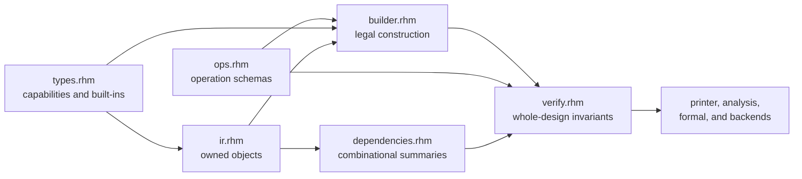

<!-- Explains how to change, extend, and validate Rhodium's backend-independent core. -->
<!-- SPDX-License-Identifier: Apache-2.0 -->

# Developing the Rhodium core

Read the core [`README.md`](README.md) first for the public semantic model,
operation reference, `Builder` API, and verification contract. This guide maps
those contracts to their implementation and explains how to change them.
Package-wide dependency rules are owned by
[`../DEVELOPING.md`](../DEVELOPING.md).

## Architecture and ownership

Core is the shared boundary between elaboration and downstream consumers. It
must remain independent of frontend syntax, analysis policy, and backend
lowering. A change to core semantics normally has four coordinated parts:

`Builder` rejects locally impossible construction. `verify_design` owns checks
that need a completed module or the whole design. `dependencies.rhm` owns
leaf-sensitive combinational reasoning, including hierarchy. `printer.rhm`
provides deterministic inspection; backend syntax does not belong there.

## Making a semantic change

### Add or change a hardware type

1. Put open capability behavior, built-in types, type equality, packing, and
   selector-width rules in [`types.rhm`](types.rhm).
2. Keep frontend-only types out of core. A frontend type should implement the
   public core capabilities without adding a core special case.
3. Update Builder checks and operation type rules that consume the capability.
4. Add focused type tests and exercise any affected operation or verifier
   boundary.

Do not add an implicit conversion to solve an authoring convenience. Core
representation changes remain explicit operations, and frontend composition
owns author-facing sugar.

### Add or change an operation

1. Add or update its [`OperationSchema`](ops.rhm), including semantic category,
   operand/result/place arity, required attributes, verifier type-rule name,
   and printer form.
2. Add the legal construction path in [`builder.rhm`](builder.rhm). Preserve
   module/design ownership, stable IDs, deterministic naming, use lists, and
   result definition links.
3. Implement schema-specific structural and type checks in
   [`verify.rhm`](verify.rhm). Checks requiring complete binding or hierarchy
   belong at verification time rather than being approximated in Builder.
4. Update [`dependencies.rhm`](dependencies.rhm) if the operation is
   combinational or changes how aggregate leaves, state boundaries, or
   hierarchy propagate dependencies.
5. Update [`printer.rhm`](printer.rhm) only when the registered printer form is
   insufficient, then update each downstream consumer that handles the opcode.
6. Add valid construction and invalid-use coverage in the closest
   operation-specific test.

An operation is not complete merely because the Builder can emit it. Its
verification, dependency behavior, deterministic text, and downstream
interpretation must agree with the public contract.

### Change verification

Keep checks at the narrowest layer that has enough information:

- Builder checks construction-local facts and keeps partially built modules
  usable.
- `verify_module` checks completed module structure and bindings.
- `verify_design` checks design ownership, cross-module references, unique
  identities, and hierarchical cycles, then seals the successfully verified
  design so downstream consumers can reuse the result.
- `verify_design_structure` and `verify_design_combinational` expose the two
  profiling and diagnostic phases without independently certifying a design.
- Optional policy or reporting that can be derived from verified IR belongs in
  `analysis/`, not in the mandatory core verifier.

All semantic mutation paths must call `Design.assert_mutable`. Adding a new
mutable IR field or collection therefore requires both a seal-aware mutation
method and a test that post-verification mutation is rejected. The verifier's
private weak identity set is the certification authority; `Design.sealed`
alone does not prove that verification succeeded.

Diagnostics should identify the owned operation, value, place, resource, or
module responsible for the violation. When dependency behavior changes, cover
both true cycles and independent aggregate leaves so conservatism does not
become a false positive.

## Implementation map

| File | Owns | Focused evidence |
|---|---|---|
| [`types.rhm`](types.rhm) | Open type capabilities, built-in types, equality, packing, and selector widths | [`types-test.rhm`](../../rhodium/core/tests/types-test.rhm), [`signed-test.rhm`](../../rhodium/core/tests/signed-test.rhm), [`shift-test.rhm`](../../rhodium/core/tests/shift-test.rhm) |
| [`ir.rhm`](ir.rhm) | Public objects, collections, ownership indexes, lookup, and `DesignElaboration` | [`verify-test.rhm`](../../rhodium/core/tests/verify-test.rhm), [`dpi-test.rhm`](../../rhodium/core/tests/dpi-test.rhm) |
| [`builder.rhm`](builder.rhm) | Legal construction, naming, aggregate-drive canonicalization, state, resources, and hierarchy | [`wire-test.rhm`](../../rhodium/core/tests/wire-test.rhm), [`memory-test.rhm`](../../rhodium/core/tests/memory-test.rhm), [`sync-memory-test.rhm`](../../rhodium/core/tests/sync-memory-test.rhm) |
| [`ops.rhm`](ops.rhm) | Opcode registry, categories, arities, type-rule names, and printer forms | Operation-specific tests under [`tests/`](tests/) |
| [`verify.rhm`](verify.rhm) | Schema, ownership, use-def, driver, resource, state, instance, assertion, DPI, and crossing checks | [`verify-test.rhm`](../../rhodium/core/tests/verify-test.rhm), [`assert-test.rhm`](../../rhodium/core/tests/assert-test.rhm), [`cdc-test.rhm`](../../rhodium/core/tests/cdc-test.rhm) |
| [`dependencies.rhm`](dependencies.rhm) | Leaf-sensitive combinational dependencies and hierarchical cycle detection | Hierarchy and aggregate-cycle cases in [`verify-test.rhm`](../../rhodium/core/tests/verify-test.rhm) |
| [`printer.rhm`](printer.rhm) | Deterministic textual IR | Exact operation-form checks across [`tests/`](tests/) |
| [`main.rhm`](main.rhm) | Public core re-exports | Import coverage through all core tests |

## Focused validation

Choose the smallest test file or files matching the contract changed:

- Value/place ownership, aggregate drives, or hierarchy: `wire-test.rhm`,
  `types-test.rhm`, and the relevant cases in `verify-test.rhm`.
- An opcode or type rule: its operation-specific test plus `types-test.rhm` or
  `verify-test.rhm` when the shared verifier changes.
- State or resource behavior: `memory-test.rhm`, `sync-memory-test.rhm`,
  `assert-test.rhm`, `cdc-test.rhm`, or `dpi-test.rhm` as applicable.
- Package imports or module movement: `make check-boundaries` in addition to
  the focused semantic test.

Run Rhombus tests with the repository test runner and its persistent
worktree-specific `PLTCOMPILEDROOTS`, as described by the owning
[test guide](../../tools/testing/README.md).
Reserve frontend, backend, and full-suite validation for changes that actually
cross those boundaries.

## Expansion documentation

`ir.rhm` owns `SemanticNode`, `SemanticDescription`, `SemanticBinding`, and
`module_semantics`. Roots use the reserved `rhodium.semantics` metadata namespace;
`verify.rhm` checks their structural graph links before certifying a design.
`printer.rhm` exposes a separate semantic-tree dump so ordinary hardware text
and naming remain stable. Extension kinds are not opcodes and cannot create
hardware behavior. Extend their behavioral interpretation in the consuming
package, with evidence for the exact recognized contract.

Run `rhodium/core/tests/semantic-node-test.rhm` for malformed bindings, ownership,
containment, immutable properties, and sealing, and the frontend
`semantic-expansion-test.rhm` for macro integration and CIRCT equivalence.

## Selective lowering implementation

`construct.rhm` owns immutable declaration/specialization records and contract
validation. `composition.rhm` owns scoped mixed compositions and their wiring,
control, effect, and dependency checks. `lowering.rhm` owns consumer-local
selection and recursive portable expansion. These modules depend only on core
modules and Rhombus; library identities and target adapters remain external.
`dependencies.rhm` exposes `module_dependency_summaries` so retained and expanded
hardware use the same leaf-sensitive combinational analysis.

Run `tests/construct-test.rhm` and `tests/composition-test.rhm` for the public
protocol, selective expansion, mixed core leaves, and malformed compositions.
Run the existing core verifier tests when changing dependency traversal. The
[execution plan](SELECTIVE_LOWERING_PLAN.md) records the remaining frontend,
Flow, simulator, and differential-validation gates; do not describe core-only
protocol tests as proof of those end-to-end milestones.

`construct.apply` embeds declared constructs in ordinary module DFGs. Builder,
verification, dependency analysis, and printing own its structural integration.
`resolve_module_constructs` traverses instance occurrences and retains a separate
selection result for each occurrence, sharing only portable expansion bodies.
Run `tests/construct-operation-test.rhm`, frontend construct elaboration/syntax
coverage, and Flow retained-queue coverage when changing this boundary. CIRCT
materialization and native execution remain separate integration gates.

`materialize.rhm` consumes resolved module occurrences and compositions, imports
portable modules, replaces retained operations with connected instances, and
verifies the resulting independent design. It allocates endpoints before
copying operations so legal forward references and state feedback survive.
Its source maps support owner-defined metadata reconstruction without
copying references across design ownership. Run `tests/materialize-test.rhm`,
backend `materialize-queue-test.rhm`, and the `materialized-queue` CIRCT fixture
for this transformation. Extension owners implement the remapping protocol
described below.

Materialization collapses a signature only when its sole retained operation
consumes every same-named input and directly drives every same-named output,
with no other hardware. Keep operation order stable when copying ordinary
modules. Source records distinguish one-to-one operation mappings from a
retained operation's one-to-many expansion. Backend Queue tests compare module
names and per-module CIRCT after alpha-renaming only backend-generated SSA
names; authored names, constants, wiring, and operation order remain checked.

`metadata.rhm` reconstructs owner-defined metadata after hardware construction
and before design verification. It caches references per source/target module
pair, scopes child controls through the selected instance, and coalesces only
owner-keyed duplicate declarations. The public protocol lives in `ir.rhm`; core
never imports an extension owner. Run `tests/metadata-remap-test.rhm` and event
materialization coverage for ownership, sealing, endpoint identity, and trace
preservation. An explicit hardware-only option retains source metadata without
attaching it to the copied design.

## Payload region ownership

`payload.rhm` owns the typed argument/capture partition and pure computation
checks. It reuses `CoreImplementation`, whole-design verification, and public
leaf dependency analysis; it does not introduce another expression opcode set.
Validate all descendant modules, including unused operations, before accepting
a region as pure. Keep frontend capture discovery and Flow transport contracts
outside core. Run `tests/payload-test.rhm` for explicit capture coverage,
immutability, purity, and dependency-contract rejection.

`payload-record.rhm` separates the immutable region declaration and weak identity
certificate registry from validation. This keeps construct parameter checking
independent of the verifier/composition import chain. Only `payload.rhm`
publishes certificates after full purity, dependency, and ownership checks;
certification helpers are internal and are not re-exported by the public core.
`construct.rhm` accepts certified regions as immutable parameters, and
`lowering.rhm` compares regions by identity for expansion progress. Printer
support exposes the body name and argument/capture split. Payload tests also
exercise direct selection, deferred portable expansion, and materialization.

`capture.rhm` owns operation-scope extraction and explicit source bindings. It
allocates value/place maps before cloning connections, recursively copies pure
child modules, rebuilds child output drives, and verifies the independent design.
Preserve readable source names where possible and disambiguate against generated
argument/capture/result names. Run `tests/capture-test.rhm` and
`tests/capture-hierarchy-test.rhm` for ownership, open source modules, repeated
captures, escaping writes, and aggregate dependencies through copied hierarchy.
