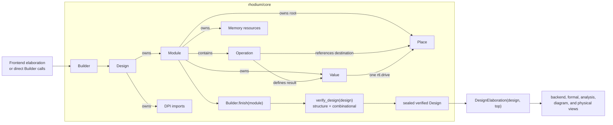

<!-- Documents the backend-independent Rhodium semantic model, public IR, and verification contract. -->
<!-- SPDX-License-Identifier: Apache-2.0 -->

# Rhodium core

The core is Rhodium's backend-independent hardware model. It defines hardware
meaning, ownership, construction, verification, and inspection; it does not
import frontend syntax or a backend. The public package map is in
[`../README.md`](../README.md); implementation architecture and contributor
workflows are in [`DEVELOPING.md`](DEVELOPING.md).

## How to use this guide

- Start with the [mental model](#mental-model) and [semantic model](#semantic-model)
  when reading or extending Rhodium.
- Use the [operation reference](#operation-reference) and
  [public API](#public-api) when constructing or inspecting core IR directly.
- If you are changing the core, use the
  [developer guide](DEVELOPING.md) to find the owning source and narrowest
  relevant tests.

Frontend syntax, profiles, and elaboration policy belong to the
[`frontend`](../frontend/README.md). Lowering belongs to the
[`backend`](../backend/README.md). This guide specifies only the common IR
contract between those producers and consumers.

## Mental model

Rhodium elaborates hardware into one typed dataflow graph per module. Five
ideas organize that graph:

1. A `Value` is readable data with exactly one defining operation.
2. A `Place` is a driveable destination with exactly one final binding.
3. An `Operation` records structure, combinational computation, state,
   verification collateral, or durable metadata.
4. A stateful resource such as `Memory` has identity and ownership; it is not
   data that can flow through a port or mux.
5. An instance does not own its child module. It references a finished module
   definition and exposes parent-local `Place` inputs and `Value` outputs.

The normal lifecycle is construction, completion, verification, and then
consumption:



Operation list order makes inspection and printing deterministic. It does not
create source-order execution semantics. Primitive registers and clocked
resources introduce time; a cycle made only of combinational dependencies is
invalid.

## Semantic model

### Elaboration result

Elaboration constructs one public SSA-style dataflow IR. There is no private
frontend IR or separate high-level and canonical pair. Host computation has
already finished by the time the core design is verified.

Each completed module is one dataflow graph. `Builder.finish` closes a module
and canonicalizes complete aggregate drives. `verify_design` checks the whole
design, including cross-module ownership and hierarchical combinational
dependencies, then seals it against semantic mutation. Repeated
`verify_design` calls on the same sealed design reuse that successful result.
`DesignElaboration` pairs the design with an explicit, finished top module for
downstream consumers.

### Values, places, and binding

A `Value` is readable hardware data. It records its hardware type, containing
module, defining-operation ID, and users. Source location and origin belong to
the defining `Operation`, so diagnostics and generated operations retain that
context without duplicating it on every result.

A `Place` is a destination that must be driven. Internal wires, module outputs,
instance inputs, register next-state inputs, and synchronous-memory input
fields are places. Driving a root place creates an explicit `rtl.drive`
operation from a same-typed value.

Every root place must finish with one effective driver and exactly one
`rtl.drive` operation. Aggregate places can be projected into record fields or
vector elements while a module is under construction. Whole-value and
element-wise drive modes are mutually exclusive; a complete set of leaf drives
canonicalizes to nested aggregate construction and one whole-value drive.

Rejecting general last-connect and unordered multiple-driver resolution is a
deliberate semantic choice, not deferred work. Conditional authoring constructs
must lower their alternatives to one selected value before driving the place.
This keeps binding independent of construction order, makes priority explicit,
reports competing drivers at their source, and gives verification and
dependency analysis one unambiguous driver edge. See the frontend
[`when` and `switch` contract](../frontend/layers/README.md#conditional-assignment-and-effects).

Most places must be driven before they can be read. A core `rtl.wire` is the
deliberate exception: it exposes a paired value immediately so construction is
independent of declaration order. The wire still requires a final driver, and
verification follows that driver when checking combinational cycles.

Values and places never cross design ownership or module scope directly.
Communication across hierarchy occurs only through ports.

### Ownership and identity

Ownership is structural, not inferred from names or list position:

| Object | Owner | Contract |
|---|---|---|
| `Design` | Root | Owns modules and design-level `DpiImport` declarations; allocates stable numeric IDs. |
| `Module` | `Design` | Contains ordered operations, ports, values, root places, memories, and extension-owned nonsemantic metadata. |
| `Operation` | `Module` | References operand values and destination places; defines its result values; carries attributes, location, and origin. |
| `Value` | `Module` and one defining operation | May be used only by operations in its legal module scope. |
| `Place` | `Module` and one declaring operation | Receives one final same-type driver; projections remain rooted in that owned place. |
| `Memory` | `Module` and one `rtl.memory` allocation | Has stable resource identity and may be referenced only by same-module memory operations. |
| `Port` | `Module` | Presents either an input `Value` or an output `Place`. |
| `Register`, `Instance`, `SyncMemory` | Returned view over an operation and its endpoints | Groups the core objects that form one state element, child occurrence, or circuit-shaped memory. |

IR identity is distinct from user-facing names. Hardware names are ASCII
identifiers beginning with a letter or underscore; `__rhodium_` is reserved
for generated names. Construction goes through `Builder`; after verification,
the supported public use is read-only inspection. User-authored IR mutation
and rewriting remain deferred until a transformation motivates coherent
transaction and handle-validity semantics.

### Hierarchy

At module and instance boundaries:

- A module input is a read-only `Value`.
- A module output is a `Place` that becomes readable after it is driven.
- A child input is a driveable instance-input `Place` in its parent.
- A child output is a readable instance-output `Value` in its parent.

An `rtl.instance` operation is owned by the parent module and references a
finished module in the same design. Its port endpoints are parent-local; the
referenced child definition remains design-owned and can be instantiated more
than once. Instance names are unique only within the parent.

Cycle analysis summarizes which child-output leaves depend combinationally on
which child-input leaves, then translates those dependencies through the
parent's instance bindings. Record-field and vector-element paths remain
distinct through structural operations and hierarchy. Registers and other
temporal sources stop the dependency walk.

### State and resources

A primitive `Register` groups a readable current value and driveable
next-state place with a `Clock`. Its reset form additionally has a `Reset` and
a same-typed reset value. On the active edge, asserted reset loads the reset
value; otherwise the register loads next state. Reset is active-high and
synchronous.

A `Memory` is module-owned state rather than a `Value` or `Place`. It has a
positive host-known depth, an element `DataType`, and one allocation operation.
`rtl.memory_read_async` produces an ordinary combinational value;
`rtl.memory_write` is a sequential effect carrying address, data, clock, and
one-bit enable. Multiple writes represent independent physical ports and must
share one clock. Address dependencies through asynchronous reads participate
in combinational-cycle checking.

A `SyncMemory` is a distinct circuit-shaped primitive, not an indexed
`Memory`. It records one clock and creates its typed input places and output
values together. The current Builder admits 1R, 1W, 1R1W, and 1RW shapes; port
collections retain their physical kinds without yet exposing general
multi-port construction. Its detailed timing, masking, and undefined-behavior
contract is in the [synchronous-memory reference](#synchronous-memories).

## Type reference

The core type capabilities are open interfaces:

| Capability | Meaning |
|---|---|
| `HardwareType` | Any hardware type with well-formedness and equality behavior |
| `DataType` | Ordinary combinational, mux, port, and register data |
| `ScalarDataType` | Scalar data with a positive, statically known packed width |
| `BitwiseType` | Scalar data supporting same-type bitwise operations |
| `ArithmeticType` | Bitwise data supporting same-type modular arithmetic and width reconstruction |
| `SignedArithmeticType` | Arithmetic data supporting signed comparison, right shift, and extension |

Core supplies `Bits(width)`, `Clock`, `Reset`, `RecordType(fields)`, and
`VectorType(length, element_type)`. `Bits` implements `ArithmeticType`; `Clock`
and `Reset` are nominal control types rather than `DataType`s. Frontend-defined
types such as `Bool`, enums, and one-hot values implement the open capabilities
without core special cases.

`packed_width()` is the single representation-width accessor. Scalars return
a positive host integer; records and vectors derive their widths recursively.
An opaque custom `DataType` may return `#false` and remain well-formed but
unpackable. Other width results are invalid. `scalar_width(type)` returns the
validated width only for `ScalarDataType`, and `#false` for aggregates, control
types, opaque types, or malformed scalar widths. `packable_type` and
`cast_compatible` also validate widths before accepting a representation.

Scalar representation does not imply bitwise or arithmetic support. Nominal
type equality is independent of width; `with_bit_width(width)` reconstructs
an arithmetic type for width-changing operations rather than querying its size.

Equal-width representations cross types only through explicit `rtl.cast`.
Clock selection is never an ordinary data mux.

### Records and vectors

`RecordType` is an ordered, nonempty structural `DataType` with unique field
names. Field names, order, and recursively equal field types participate in
`type_equal`. An optional preferred declaration name is non-semantic metadata:
it does not make structurally equal records distinct. `RecordType` subclasses
retain this structural equality and may not replace it with nominal equality.
A packable record has no padding. Its first declared field occupies the
most-significant bits, recursively.

`VectorType` has a positive host-known length and one recursively equal element
`DataType`. A packable vector has no padding, and element zero occupies the
least-significant element-width bits. This convention applies recursively to
nested vectors and record elements.

### Width rules

- Every `Bits` width is a positive host `Int` known during elaboration.
- Constants specify a width and must fit it.
- A don't-care grants synthesis freedom for every bit; it is not a runtime X
  value and defines no four-state propagation semantics.
- There are no implicit conversions.
- Narrowing and extension use explicit operations.
- Fixed-width arithmetic is modular; signedness does not change its packed
  add, subtract, or multiply result.
- Logical and arithmetic shifts preserve value width. Overshifts produce zero
  for unsigned right shift and the sign fill for signed right shift.
- Expanding arithmetic is frontend composition over explicit extensions and
  modular core operations.

These width rules are deliberate, not placeholders for a separate unsigned
integer hierarchy or an inference pass. Rhodium uses `Bits(width)` for raw
packed data and unsigned modular arithmetic, keeps every width explicit during
elaboration, and requires named operations for width changes. A distinct
`UInt`, implicit widths, and general width inference are intentionally outside
the language model. Consequently, operation types and result widths do not
depend on surrounding expressions or a later backend inference phase.

## Operation reference

Operations use namespaced `rtl.*`, `construct.*`, `cdc.*`, `verif.*`, and `sim.*` opcodes plus
the static registry in [`ops.rhm`](ops.rhm), rather than a closed node-class
hierarchy. Each `OperationSchema` records semantic category, operand/result/
place arity, required attributes, a verifier type rule, and a printer form.
Backend lowering choices are not part of core schemas.

| Group | Core opcodes |
|---|---|
| Retained constructs | `construct.apply` |
| Structure | `rtl.input_port`, `rtl.output_port`, `rtl.wire`, `rtl.drive`, `rtl.instance` |
| Sources | `rtl.constant`, `rtl.dont_care` |
| Bitwise and arithmetic | `rtl.not`, `rtl.and`, `rtl.or`, `rtl.xor`, `rtl.add`, `rtl.sub`, `rtl.mul`, `rtl.shl`, `rtl.shru`, `rtl.shrs` |
| Comparison and selection | `rtl.eq`, `rtl.ult`, `rtl.slt`, `rtl.mux_lookup`, `rtl.onehot_mux`, `rtl.decode` |
| Conversion and width | `rtl.cast`, `rtl.concat`, `rtl.extract`, `rtl.zext`, `rtl.sext`, `rtl.trunc` |
| Aggregates | `rtl.record_create`, `rtl.record_get`, `rtl.vector_create`, `rtl.vector_get`, `rtl.vector_index`, `rtl.vector_inject`, `rtl.vector_write_set` |
| Memories and registers | `rtl.memory`, `rtl.memory_read_async`, `rtl.memory_write`, `rtl.sync_memory`, `rtl.register`, `rtl.register_reset` |
| Crossing evidence | `cdc.sync_level` |
| Verification | `verif.assert` |
| Simulation | `sim.dpi_call`, `sim.dpi_register` |

Representative type rules are:

```text
not(T: BitwiseType)                         -> T
dont_care(Bits(w))                          -> Bits(w)
and/or/xor(T: BitwiseType, T)               -> T
add/sub/mul(T: ArithmeticType, T)           -> T
shl(T: ArithmeticType, Bits(a))             -> T
shru(Bits(w), Bits(a))                      -> Bits(w)
shrs(S: SignedArithmeticType, Bits(a))      -> S
eq/ult(Bits(w), Bits(w))                    -> Bits(1)
slt(S: SignedArithmeticType, S)             -> Bits(1)
mux_lookup(Bits(w), keys -> T, default: T)  -> T: DataType
decode(I: packable DataType,
       input cubes -> output cubes,
       default output cube)                 -> O: packable DataType
wire(T: HardwareType)                       -> (Value<T>, Place<T>) alias pair
record_create(fields matching R)            -> R: RecordType
record_get(R, field_name)                   -> R.field_type(field_name)
vector_create(elements matching V)          -> V: VectorType
vector_get(V, host_index)                    -> V.element_type
vector_index(V(n, T), Bits(index_width(n))) -> T
vector_inject(V(n, T), Bits(index_width(n)), T) -> V
vector_write_set(V(n, T), V(p, Bits(1)),
                 V(p, Bits(index_width(n))), V(p, T)) -> V
cast(A: packable, B: same packed width)     -> B
onehot_mux(Bits(n), n values of T)          -> T: packable DataType
concat(Bits(a), Bits(b), ...)               -> Bits(a + b + ...)
extract(Bits(w), high, low)                 -> Bits(high - low + 1)
sext(S: SignedArithmeticType, wider width)  -> S.with_bit_width(wider width)
memory(depth, T: DataType)                  -> Memory<T>
memory_read_async(Memory<T>, address)       -> T
memory_write(Memory<T>, address, T,
             Clock, one-bit enable)         -> void
sync_memory(depth, T: DataType, Clock,
            read?, write?, read_write?,
            mask_granularity?)              -> SyncMemory<T>
assert(one-bit condition, Clock, Reset,
       one-bit guard, optional label)        -> void
dpi_call(procedure, Clock, enable, args...) -> void
dpi_register(function, Clock, enable,
             args...)                       -> one or more flat result types
```

### Selection and partial values

Mux keys are unique nonnegative host integers that fit the selector width and
are normalized into increasing order. Every lookup has a default and at least
one case. There is no `rtl.mux`: a binary Boolean mux is a frontend
specialization of `rtl.mux_lookup`.

`rtl.vector_index` and `rtl.vector_inject` use the minimum nonzero selector
width capable of encoding every element. A selector encoding greater than or
equal to the vector length is undefined: the operation result is unconstrained,
and for injection that means the complete result vector is unconstrained.
Static `rtl.vector_get` remains host-indexed and always in range.

`rtl.vector_write_set` applies an unordered, nonempty collection of enabled
dynamic writes. Enabled indices must be in range and pairwise distinct. If
that precondition is violated, the result is undefined: no port has priority
and backends need not add collision detection. A disabled port has no effect.

`rtl.onehot_mux` is a separate partial selection primitive. Its selector width
must equal its number of same-typed choices. Exactly one selector bit being set
is a caller precondition; zero-hot and multi-hot selectors have an unspecified
result. This permits direct selector-bit gating and reduction without validity
logic or a default value.

The absence of conditional-connect operations, general IR regions, and
control-flow blocks is also deliberate rather than deferred. Host control flow
runs during elaboration; frontend hardware conditionals canonicalize to mux
lookups, guarded effects, and one final drive. Every core consumer therefore
receives one explicit dataflow graph instead of having to interpret region or
control-flow semantics before dependency analysis, verification, formal
translation, or backend lowering.

`rtl.dont_care` is deliberately narrower than an unknown-value model. It is a
zero-operand `Bits` source whose bits may be chosen independently by synthesis.
Verification and inspection preserve that optimization freedom, while each
backend selects its own carrier representation. It does not alter assignment
completeness, register hold behavior, comparisons, muxes, or simulation into
four-state operations.

`rtl.decode` preserves an unordered, non-overlapping relation between packed
input cubes and partially specified output cubes. Every cube stores canonical
`value & care` and `care` images. Cared output bits constrain the result;
uncared bits grant the same per-bit synthesis freedom as `rtl.dont_care`.
Input and output may have different packable `DataType` types, including
records and vectors. Backends may choose any implementation satisfying the
relation, so core does not expand a decode into a particular mux or gate
network.

### Synchronous memories

A synchronous-memory read port has driveable `address` and one-bit `enable`
fields plus readable `data`. A write port has driveable `address`, `data`, and
one-bit `enable`. A shared read-write port has driveable `address`, `enable`,
one-bit `write`, and `write_data` fields plus readable `read_data`. With an
enabled shared port, `write = 0` selects a read and `write = 1` selects a write.
Addresses are exactly `Bits(index_width(depth))`.

A memory may optionally declare a positive host-known mask granularity that
evenly divides the packed element width. Each write port then gains a required
mask field of type `Bits(element_type.packed_width() / mask_granularity)`; the
shared port names it `write_mask`. Mask bit zero controls the least-significant
packed granule. A one writes that granule and a zero preserves its stored bits.
The layout belongs to the memory and will be shared by every future
write-capable port. Masking requires a statically packable element type.

An enabled read presents its data one rising edge after its address is sampled.
Read output while its enable is false, or after a shared-port write, is
unspecified. An all-zero mask preserves every stored bit but remains a
write-mode cycle on a shared port. Initial contents, out-of-range addresses,
and collisions between separate ports are unspecified. The primitive has no
reset, initialization, inferred ports, or direct indexing.

### DPI simulation operations

DPI imports belong to a design and have one or more named flat inputs. A
procedure has no results. A function has zero or more ordered `out` results
followed by exactly one `return` result. A result-less `sim.dpi_call` represents
a clocked procedure effect. A result-bearing `sim.dpi_register` produces one
visible state value per result; all hold while disabled. Both operations carry
an explicit clock and one-bit hardware enable. They are deliberately
unsynthesizable core semantics rather than frontend-only annotations.

### Clocked assertions

`verif.assert` checks a readable one-bit condition on each rising clock edge
while its one-bit guard is asserted. It is disabled while its active-high reset
operand is asserted. Frontends use the guard to record lexical activation from
hardware conditionals; it is not a user-facing assertion enable or a hidden
state element. The optional label is an ASCII identifier used to identify the
check after backend lowering. Assertions have no results or places; they
remain verification collateral in every containing module and therefore apply
independently to every instance.

The core operation is deliberately limited to a current-cycle condition. It
does not define temporal sequences, formatted messages, assumptions, coverage,
or immediate combinational checks.

### Stable-level crossing evidence

`cdc.sync_level` is a zero-result metadata operation tying a stable one-bit
source and destination clock to at least two ordinary, resetless register
stages. The operation is core because the promise must survive into downstream
inspection; clock-compatibility policy and reports remain owned by
[`analysis`](../analysis/README.md).

## Public API

The public object model includes:

```text
Design        DesignElaboration  DpiImport   DpiResult   Module       Operation
Value         Place              Port        Register    Memory       SyncMemory
Instance      HardwareType       Location    Origin
```

Callers can walk designs, modules, and operations; follow definitions,
drivers, and users; find direct instances by final name; and print deterministic
text with `dump_ir`. `Module.find_instance(name)` returns the stable direct
`rtl.instance` operation rather than relying on operation or module order.

### Builder

`Builder` is the low-level construction API:

```text
design = Design()
builder = Builder(design)
module_def = builder.module("Adder")

a = builder.input(module_def, "a", Bits(8))
b = builder.input(module_def, "b", Bits(8))
sum = builder.output(module_def, "sum", Bits(8))
result = builder.add(module_def, a, b, "result")
builder.drive(sum, result)
builder.finish(module_def)

verify_design(design)
dump_ir(design)
```

The Builder owns one design and edits an explicit open module. It rejects
locally impossible construction immediately; whole-graph checks run at
verification boundaries. `Builder.instance` uses an exact name, while
`Builder.suggested_instance` deterministically allocates a collision-free
name.

The core API is re-exported by [`main.rhm`](main.rhm). CIRCT is imported
separately from [`../backend/circt.rhm`](../backend/circt.rhm). Optional
clock-use and temporal-provenance inspection is exported separately by
[`../analysis/clocking.rhm`](../analysis/clocking.rhm); those policy, report,
and environment objects are not part of the core API.

## Verification contract

The Builder and whole-design verifier enforce:

1. Every value and root place belongs to exactly one design and one module.
2. Values are used only in legal module scopes.
3. Input ports are never driven.
4. Every output, instance input, register next-state place, and synchronous-
   memory input field has exactly one effective driver and drive operation.
5. A place and its driver have exactly the same hardware type.
6. Operation operands, results, places, attributes, and types satisfy their
   registered schema.
7. Record fields and vector elements match their aggregate type completely;
   whole and element-wise drive modes remain consistent.
8. Mux selectors, keys, cases, and defaults are well typed and valid.
9. Register clocks are `Clock`; reset operands are `Reset`.
10. A `cdc.sync_level` crossing has one `Bits(1)` source, at least two distinct
    resetless destination-clock register stages, a direct chain, no
    intermediate functional fanout, and exclusive ownership of its stages.
11. Reset presence and reset-value presence match, and reset value equals the
    state type.
12. DPI operations reference a same-design import and exact signature, with a
    clock and one-bit enable.
13. Assertions have a one-bit condition and guard, a `Clock`, a `Reset`, and an
    optional identifier label.
14. Instances reference completed same-design definitions and have unique
    final names within their parent.
15. Purely combinational cycles are rejected, including cycles that cross
    instance boundaries. Dependency summaries preserve record-field and
    vector-element paths through structural operations and hierarchy, so an
    independent aggregate leaf does not create a false cycle. Operations that
    reinterpret a packed representation, including `rtl.cast`, conservatively
    depend on every source leaf.

The frontend separately rejects active recursive generator elaboration,
runtime hardware circuit parameters, and hardware-controlled host computation.
Compilation verifies every completed design before lowering.

`verify_design_structure` runs the ownership, schema, type, driver, resource,
and identity checks without certifying the design. After that succeeds,
`verify_design_combinational` can run the hierarchical cycle check separately.
`verify_design` remains the normal public entry point: it composes both phases,
seals the design only after both succeed, and reuses that result for later
consumers. A failed phase leaves the design unsealed.

## Implementation map

The source ownership table moved to
[`DEVELOPING.md`](DEVELOPING.md#implementation-map).

## Focused validation

Contributor test selection and commands moved to
[`DEVELOPING.md`](DEVELOPING.md#focused-validation).

## Retained expansion semantics

A design may retain an optional tree of `SemanticNode` records per module,
returned by `module_semantics(module_def)`. These document high-level expansion
intent alongside the ordinary executable hardware graph. Generic consumers,
including CIRCT emission, can ignore the tree without changing behavior.
`dump_semantic_ir(design)` prints its hierarchy and graph bindings separately
from `dump_ir`.

Each node has an extension-owned `kind`, a `SemanticDescription`, the local
operations emitted by its expansion, and nested expansion children. A description
contains named `SemanticBinding` entries, immutable properties, and explicit
references to existing local operations (such as an implementing instance).
Bindings reference a local `Value` or root `Place` and an optional record/vector
field path; retaining a field never creates a projection operation. Places may
be bound before they are driven; consumers inspect their completed drivers.

Verification checks module ownership, binding paths and names, immutable
properties, operation references, tree uniqueness, and containment of child
implementation operations. The design's existing seal also protects retained
roots. Properties contain only strings, integers, Booleans, immutable lists,
and immutable string-keyed maps. Hardware references belong in bindings or
operation references, not properties.

These records document semantics; structural validation does not prove a
behavioral replacement equivalent. A consumer must recognize and validate the
specific extension contract before specializing it. Unknown kinds retain their
ordinary hardware implementation. Nodes do not introduce execution ordering,
state, activation, or permission to skip observable computation.

The [frontend expansion API](../frontend/README.md#retaining-expansion-semantics)
opts into retention and supplies the generic hook used by flow descriptions.

## Retained hardware constructs

The public core also exposes an explicit composition level for consumers that
need to select implementations before expanding hardware. This is executable
structure, separate from the descriptive `SemanticNode` metadata above. The
frontend can retain declarations as `construct.apply` operations in the same
module DFG with `~constructs: #true`; ordinary elaboration executes the portable
body. The [selective lowering plan](SELECTIVE_LOWERING_PLAN.md) tracks the
remaining consumer integration.

A library exports a nominal `ConstructIdentity(name, version)` and creates a
`ConstructSpecialization(identity, parameters, contract)` for each parameter
configuration. Names are diagnostic; matching uses declaration identity.
Parameters are immutable strings, booleans, integers, hardware types, verified
[payload regions](#payload-computation-regions), lists,
and string-keyed maps. A `ConstructOccurrence` adds its own name and location.
Implementations must preserve occurrence-local state even when specializations
are shared.

`ConstructContract` declares typed input/output ports, every output leaf's
combinational input dependencies, clocks, reset timing/polarity, and named
effects with their clocks. An empty dependency list for an output explicitly
means independence from current inputs; omitting that output is invalid.
Aggregate dependencies use `PortLeaf(port, path)` and remain field-sensitive.
The library is responsible for the semantic truth of its declared contract;
structural verification cannot establish behavioral equivalence of native code.

`HardwareComposition` contains named `CompositionInstance` objects whose bodies
are specializations, nested compositions, or `CoreImplementation` modules.
`CompositionEndpoint` references an instance by identity, or `#false` for the
enclosing boundary, and optionally selects an aggregate path. Connections
require matching types and directions, exactly one driver per input/output
sink leaf, and local references. Unused sources are permitted. The verifier
checks internal combinational cycles and checks that boundary summaries cover
all actual dependencies. Core module summaries come from the existing core
dependency engine, not user-authored guesses.

Composition clocks and resets must resolve to declared boundary controls with
matching timing and polarity. `CompositionEffect` explicitly maps each child
effect into a same-kind, same-clock boundary effect; multiple child effects can
contribute to one boundary effect. Missing child or boundary effects are errors.
`CoreEffectBinding` maps each clocked state/effect operation, including nested
module occurrences, to a declared effect. Core implementation checks require
complete mappings with matching effect kinds, clocks, and synchronous active-high
reset associations. Controls currently resolve through direct ports, wire aliases, and reset
casts; a cast to Clock introduces a distinct clock identity. Other derived control expressions require a richer
contract before they can be accepted. These checks establish structural
correspondence; behavioral equivalence still requires differential validation.

`ExpansionProvider(identity, expand)` supplies a deferred portable body.
`TargetLowering(identity, target, applicable, lower)` supplies an optional direct
implementation. `resolve_construct` takes explicit consumer-local registration
lists. It selects a unique applicable lowering before invoking an expansion,
otherwise expands recursively into smaller constructs, compositions, or core
modules. The optional `~lower_core` callback handles verified core leaves.
The result preserves composition wiring and ordered per-instance results;
backend code owns execution and emission. Resolution does not itself schedule
or simulate the design.

Selection receives the occurrence path, allowing different choices for two
instances of the same specialization. No global registry or selection cache
crosses target invocations. Portable expansion bodies are cached by immutable
specialization identity within one resolution, while target lowering runs
separately for each occurrence. Ambiguous choices, unsupported leaves, repeated
non-progressing specializations, changed expansion boundary contracts, and an
exceeded expansion-depth limit produce diagnostics. A direct lowering may
terminate an otherwise recursive occurrence.


### Constructs inside module DFGs

`Builder.construct_apply(module, specialization, inputs, name)` creates one
retained occurrence with ordinary Value operands/results. Operand/result order
follows the specialization's input/output port order. Its body has not been
expanded. Verification checks the declaration, local ownership, port types,
arity, occurrence naming, and use-def links. Combinational cycle analysis uses
the same complete leaf dependency contract as explicit compositions. State and
effects belong to the occurrence even when it has no output values.

`resolve_module_constructs(elaboration, target, expansions, lowerings,
~lower_core: callback)` resolves these nodes through the module hierarchy.
Its `ResolvedModuleOccurrence` tree preserves the original verified module,
instance path, child occurrences, and per-operation resolutions. Shared module
definitions do not share selection decisions or state identities. Resolution
can return consumer-defined direct results or verified portable core bodies;
it does not modify the original design or schedule execution.

`bind_core_implementation(module, contract, effect_name)` helps library providers
produce a verified portable `CoreImplementation`. The callback receives each
state/effect operation and its nested instance path and selects the declared
effect name. The helper performs complete mapping and dependency/control
verification; it does not infer library meaning from display names.

### Materializing portable implementations

`materialize_constructs(elaboration, expansions, ~target: "rtl", ~lowerings: [], ~metadata: #true)`
resolves retained occurrences and returns a `MaterializedDesign`. Its
`elaboration` is a newly owned, verified `DesignElaboration` containing ordinary
core operations and modules reachable from the selected top. Pass
`result.elaboration.design` to a backend.
Nested compositions become modules; retained operations become instances with
named port connections. Direct lowerings for this consumer must return a
verified `CoreImplementation` with the same boundary contract.

Materialization leaves the original sealed design intact. Reused portable
modules remain shared definitions, and occurrences retain independent state.
DPI declarations with matching names/signatures are shared; incompatible
signatures are rejected. Module names are deterministic and collision-free,
with authored module names reserved before portable imports. Signature-only
modules adopt their selected implementation under the authored name; modules
with additional hardware or non-identity boundary connections keep their
explicit hierarchy.

`result.sources` contains `MaterializedModule` records linking each copied
module to its source and immutable maps from source value/place/operation IDs
to copied objects. For a collapsed signature, `expansions` maps the retained
operation ID to the implementation's operation list; the `operations` map
contains only references with a single corresponding operation. Both the
signature and portable implementation have source records for the same target
module. Materialization rebuilds metadata by default through the owner-defined
`ModuleMetadataPayload.remap_hardware(mapping)` method. Unsupported owners
produce an error; `~metadata: #false` explicitly requests hardware-only output
while retaining access to source metadata through these records.

`MetadataRemapping` supplies scoped `entity(value)`, `operations(operation)`
(one-to-many expansion), `for_instance(instance)` (child-local controls), and
`memoize(object, build)` (shared extension objects). Metadata owners must retain
sharing when identity links annotations to endpoints. A stable
`materialization_key()` may coalesce interchangeable declarations within one
namespace; portable implementation metadata takes precedence over a collapsed
signature's duplicate declaration. The default key is `#false`, retaining every
entry. Core semantic descriptions, sync-circuit declarations, and interface/trace
records implement this protocol.

`Module.add_metadata` is allowed after hardware construction finishes and before
verification seals the design. This lets transformation passes rebuild metadata
once all hardware mappings exist. Attaching metadata to a sealed design remains
an error. Materialization does not rewrite source hardware or metadata.

## Payload computation regions

`payload_region(module_def, arguments, captures)` builds a `PayloadRegion` from
an ordinary pure core module. `arguments` and `captures` are disjoint lists of
input-port names and together must cover every input. Port types define the
argument, capture, and result types. Capture ports receive live hardware values;
they do not hold elaboration-time snapshots. Results are the module output ports.

The region's `implementation` is a `CoreImplementation` that can be connected as
a leaf in a `HardwareComposition`. Its contract derives field-level dependencies
from the module body. The factory verifies and seals the owning design; finish
building that design before creating a region. `verify_payload_region` also
checks explicitly constructed records, including their declared dependencies.
Regions permit pure hierarchical computation and reject state, effects, control
ports, and unexpanded constructs. Transport state and effects belong outside the
payload computation.

Flow uses these records for [retained payload mapping](../../flow/README.md#retained-payload-mapping);
source capture discovery belongs to the frontend extension hook.

Verified regions may also appear in `ConstructSpecialization.parameters`,
including nested lists or maps. Direct lowerings receive the region before
portable expansion and can lower its computation through the generic core path.
Portable providers can return its `implementation` or embed that implementation
in a larger composition. Explicitly constructed region records must pass
`verify_payload_region` before use as parameters. Different region objects remain
distinct during recursive expansion checks; no equivalence of arbitrary payload
programs is inferred. IR text identifies the body module and argument/capture
partition.

`capture_payload(source, operations, arguments, results, ~name: "Payload")`
extracts a scoped computation while its source module is still being built.
It returns `CapturedPayload(region, arguments, captures)`: the region owns an
independent verified design, while the binding lists refer to the original live
hardware values. Inputs are ordered as arguments followed by captures. Repeated
references to the same external value share a capture port. A result outside the
selected operation scope is also captured.

The selected body can contain combinational operations, complete local wires,
and pure module instances. Child modules are copied into the independent design.
State, external effects, resource references, and writes outside the selected
scope fail explicitly. Finish aggregate place connections before extracting
them. Extraction does not seal or modify the enclosing design.
