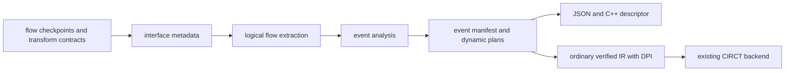

<!-- Defines event compiler ownership, lineage lowering invariants, and extension validation. -->
<!-- SPDX-License-Identifier: Apache-2.0 -->

# Developing event graphs

Read [README.md](README.md) for annotation APIs, supported behavior, and limits.
This package owns static inference, manifest serialization, and immutable
instrumentation, not functional flow behavior, core semantics, or CIRCT lowering.

## Architecture and ownership



| Owner | Responsibility |
|---|---|
| `flow/event.rhdl` | Transparent convenience checkpoints |
| `rhodium/frontend/layers/interface.rhm` | Generic event metadata and typed trace contracts |
| `rhodium/diagram/` | Resolve topology metadata against verified IR connectivity |
| `model.rhm` | Sites, dependencies, manifests, and IR-backed plans |
| `analyze.rhm` | Occurrence expansion and nearest-predecessor inference |
| `json.rhm` | JSON and matching C++ descriptor from one manifest |
| `copy.rhm` | Remap values, places, memories, DPI declarations, and instance bindings |
| `instrument.rhm` | Validate plans, selectively rebuild hierarchy, and emit state/DPI operations |
| `main.rhm` | Public re-exports |
| [RHEG](../../rheg/DEVELOPING.md) | Independent C++ collector and exporter |

Core, frontend, standard/flow libraries, diagrams, and backends must not import
this optional consumer. Instrumentation produces ordinary verified IR; do not
add event cases to CIRCT lowering. RHEG consumes the generated descriptor and
DPI ABI, not compiler sources. The authoritative package inventory is
[rhodium/DEVELOPING.md](../DEVELOPING.md).

## Dynamic lineage plans

`InterfaceTraceModel` is shared by module-local endpoint contracts and inline
transforms. `owner_path()` resolves sampled controls relative to the declaring
module or an explicitly bound immediate child; occurrence expansion prefixes
the actual hierarchy path. Fixed-latency contracts also retain their storage
occurrence for reset validation, even without sampled controls.

Diagram `delegate_ports` maps presentation-wrapper terminals onto child
boundary ports. Expand those children exactly as ordinary instances and do not
also construct a trace stage for the wrapper. Never infer behavior from a
display label, skip a child checkpoint, or count child storage twice. Frontend
and diagram contract validation reject competing declarations and overlapping
endpoint ownership before inference. Named relations may coexist with internal
Flow; preserve upstream/downstream transforms and checkpoints in the plan.

Keep static `EventDependency` paths for possible-parent reporting. Dynamic
`trace_plans` are finite occurrence-keyed graphs, not independently delayed
static edges. Acyclic regions retain memoized expressions; `EventTraceLink`
resolves back references once graph discovery completes. Storage before selection belongs to its input branch;
storage afterward wraps the selected lineage exactly once. `trace_stages` is
the linear compatibility projection and becomes false across nonlinear plans.
`DiagramTraceEdge` records an explicit retained-state relationship between two
annotated local event outputs. Analysis lowers it to a one-stage
`EventTraceRetained` plan and omits the child's ordinary topology predecessor;
the named storage controls define the lifetime, while the metadata edge does not
alter functional wiring. One scope has one parent route and may feed multiple
children. Keep this escape hatch narrow: ordinary Flow must continue to supply
its own typed contracts and nearest-parent inference.

| Plan | Information retained for lowering |
|---|---|
| `EventTraceSource` | Nearest annotation, supported unannotated root, or unknown boundary |
| `EventTraceLink` | Resolved occurrence-qualified feedback vertex, preserving identity across repeated visits |
| `EventTracePipeline` | Input plan and ordered fixed, elastic, queue, retained-owner, or retained-window stages |
| `EventTraceSelection` | Ordered input plans and occurrence-qualified grants |
| `EventTraceRouting` | Input, concrete router ID, original predicates, output index |
| `EventTraceReplication` | Input, concrete atomic-fork or retained-output ID, output index |
| `EventTraceBroadcast` | Input, concrete broadcast ID, acceptance, recipient pending control |
| `EventTraceJoin` | Ordered contributing input plans |

`event_trace_capacity(plan)` is one at a source, the sum at a join, the maximum
at selection, multiplied by the selected-window length plus its optional live
contribution at window storage, and
unchanged through other storage/routing/replication. Solve these equations to a
least fixed point over the finite graph; continued growth beyond graph-size
propagation is an unbounded-capacity diagnostic. Lower lineage
to transaction validity plus `VectorType(P, EventRef)`. A reference contains
`valid`, numeric `site`, and `sequence`; numeric sites index the occurrence-aware
manifest rather than a lossy hierarchy hash. Hidden annotation ports remain
singleton references because each annotation replaces incoming ancestry.

Selected `~parents` searches are keyed by vertex and requested site, passing
through checkpoint identity wiring until that site is reached. Capture a separate
ordinary nearest-checkpoint topology in the manifest for fanout certification;
the selected graph controls emission, not physical-connectivity authorization.
`EventTraceRequire` checks each requested contribution at the consumer. A known
branch without the selected site carries an absent reference through storage, not
an invented root or unknown marker; filtering may prevent that branch from firing
the consumer. Broadcast and retained caches must distinguish selected reference
streams, so shared functional storage never aliases different ancestors.
Inline and late parent binding have the same finalized metadata. Qualified
checkpoints remain cut points; consumers selecting older ancestors traverse their
identity wiring, not a synthetic bypass or modified functional valid signal.

At a join, transaction validity is the conjunction of contributors; it is not
the conjunction of every padded slot. Preserve each slot's validity when padding
selection inputs. Registers and memories must use the incoming lineage type and
matching invalid values, including after joins. Emit one edge per valid slot
after asserting transaction completeness. Keep duplicate slots in hardware;
RHEG deduplicates full occurrence pairs. Never deduplicate by site alone.

Every checkpoint traverses its inputs unless an explicit retained relation
supplies them. Failed traversal must not become a known root. Strict mode rejects partial
annotated ancestry; both modes reject
uncertified merges/fanout. Leaves are derived from connectivity, not declared
on checkpoints. Stall observations remain leaf-only through their separate kind
and exclusion from downstream lineage discovery.

### Selective hierarchy rebuilding

Mark event-bearing occurrences, observed control-source occurrences, and their
ancestors. Ancestors retarget children and forward hidden metadata; only local
sites get counters and occurrence calls, while the top owns reset emission.
Import each unmarked definition once, memoized by original identity, preserving
its child-definition sharing. Parent instance operations must still be recreated:
core ownership forbids references to modules in another design. Reserve original
names before allocating specialization names. Original extension metadata stays
on the original elaboration and manifest, including for unchanged imports.

Copying scales with distinct unchanged definitions plus specialized occurrences;
analysis remains occurrence-aware. Validate clock/reset ancestry for event and
observed-control owners through their ancestor bindings. Untouched opaque
subtrees may retain private domains.

Fixed-delay stages retain their implementation occurrence even without sampled
controls. Validate those storage subtrees against the root epoch too. Validate
domain inputs and local clocked uses, not casts that merely construct a private
reset for an unrelated child. Such children remain untraced; a separately reset
pipeline carrying lineage must still fail validation.

Route original control values through passive observation ports, deduplicated
by occurrence path and value ID, preserving widths. Never reconstruct controls
by signal name or drive functional RTL from trace state. Memoize plan values
across consuming sites in one rebuilt module. For feedback, preallocate storage
reads with deferred input wires, then lower combinational plans and connect
the writes. Remove provably disabled queue bypass muxes structurally. Do not
duplicate a state node on each recursive visit. Observation-port pruning and
sharing shadow state across different consuming modules remain separate optimizations.

### Feedback analysis

Discover reachable vertices once, stopping at events and missing boundaries.
For cyclic regions, retain one finite witness per nearest parent, with unknown
latency and no linear stage projection; do not enumerate cyclic walks. Acyclic
dependencies preserve their existing paths and latency detail. All reachable
opaque or unsupported branches fail in strict mode. Partial mode cuts precisely
at the missing boundary and records `EventTraceGap` entries per consuming site.
`EventTraceSource.unknown` distinguishes these leaves from supported inferred
roots. Do not replace a whole mixed plan with a root.

Lineage structs carry transaction validity, parent slots, and an independent
unknown bit. Selection chooses all three together; joins and selected windows
OR unknown contributors. Queue, retained, pipeline, and broadcast state preserve
the bit through the same controls as their parents. `rheg_unknown` marks only
fired occurrences with unknown incoming ancestry, including plans with no known
parent edges. Checkpoints replace ancestry with their own definite reference.
Keep malformed contracts and unsafe graph invariants fatal in both modes.

Walk the same-cycle dependency graph separately, cutting registered storage
edges but keeping potentially enabled bypass inputs. Check every node, including
storage inputs, so one stateful loop cannot hide an unrelated combinational loop.
Reference/control discovery and capacity analysis use identity-keyed visited
sets or fixed points. Feedback retains single-parent capacity but permits
multiple downstream checkpoints. For branching feedback, form the union of
child plans, resolve back references, and canonicalize checkpoint sources by
site identity. Reverse plan inputs into consumer edges, including explicit
child exits, then walk forward from the source once. Every multi-consumer node
must lead to distinct outputs of one certified router, fork, or broadcast.
Do not treat decisions on different laps as mutually exclusive. The acyclic
path-divergence verifier remains for acyclic plans and scoped retained edges.
No routing-policy or CHI-opcode knowledge belongs in either analysis.

### Storage lowering

- **Fixed latency:** compose certified cycle counts and place an unconditional
  lineage delay line at the consumer. Reset each stage to invalid. When the
  contract supplies an explicit flush, observe it from its declaring occurrence
  and invalidate every stage on that edge, ahead of incoming lineage. Keep
  pre-edge observations and graph sequence counters intact. Functional
  pipeline definitions remain shareable; consumer handshakes suppress filtered
  transactions even across hierarchy.
- **Elastic stages:** preserve ordered `EventTraceStage` controls. Load on actual
  advance, load invalid for a bubble, and hold on stall; reset takes priority.
  A variable-latency summary cannot replace the original advance/input-valid plan.
- **Queues:** `EventTraceQueue` retains actual writes/removals, addresses, head
  validity, and bypass selection. Allocate same-depth async-read shadow memory
  without duplicating pointers or occupancy policy. Suppress writes on reset;
  functional occupancy hides stale entries without a reset sweep. Empty bypass
  uses the live input. Nonblocking writes preserve the old head on full
  simultaneous replacement. Assert parent presence on removal and consumption.
- **Buffered broadcast:** allocate one reference register per broadcast within
  a consuming plan, shared on reconvergence. Capture on acceptance, otherwise
  hold; reset invalidates it. Gate each recipient with its actual pending bit.
  Never bypass with the incoming reference: simultaneous last delivery and
  replacement must expose the old resident identity. Add no shadow pending logic.
- **Retained owner:** `EventTraceRetained` samples capture, release, and active
  from the declared owner. Capture takes priority over release in next-state
  metadata; emission reads the old resident reference and never consumes it.
  Assert capture completeness, no live overwrite without release, and no idle
  release. Gate reads with functional active state and reset metadata to invalid.
  This is repeatable transaction ownership, not elastic/FIFO removal semantics.
- **Retained window:** `EventTraceWindow` samples enqueue, prefix release count,
  occupancy, flush, and per-slot contribution predicates. Shift a depth-sized
  vector of lineages by the actual release count and append at remaining
  occupancy; flush/reset invalidate it. Add no shadow pointers or occupancy
  controller. Read old entries before simultaneous release/replacement and
  concatenate only selected parent slots. Completeness requires at least one
  selected entry and valid lineage in every selected occupied slot. Capacity
  multiplies by the selection-window length, including through later storage.
  Assertions check occupancy bounds, release bounds, append space, and capture
  completeness. Slot reads do not consume lineage. An optional live-input
  predicate appends one independently selected incoming lineage, allowing
  bypass or simultaneous live/retained contributions without capturing it.
  Capacity includes that extra contribution and remains correct through later
  storage. Flush suppresses all contributions; selected live inputs must be
  complete just like selected resident entries. A potentially enabled live
  contribution remains a same-cycle dependency in feedback validation; only
  an absent or provably disabled live input permits a registered cut.

Unknown boundaries lower to valid transactions with invalid parent slots and
the unknown bit set. Ordinary unannotated inputs beside annotated ancestry are
also unknown in partial mode and cannot silently satisfy strict completeness.
Never emit a synthetic node for a missing boundary.

### Selection and replication lowering

Select whole lineages with the original grants; default to invalid and assert
pairwise exclusion using an accumulated seen-grant bit. Buffered input plans
remain independent and downstream storage retains the selected transaction even
when grants change later. Do not union all possible parents of an arbiter.

Routing wraps the input before branch-local storage and gates each branch with
the original inline predicate. Assert mutual exclusion rather than rebuilding
the decoder. Atomic replication lowers to its input unchanged, adding no local
state or observation controls. Preserve router/replicator IDs during inference
for the fanout check even when lowering needs no additional hardware.

For every pair of paths to different child sites, require divergence at distinct
outputs of a common certified router or replicator. Different transforms or the
same output do not authorize fanout. Routing exclusion concerns a transaction's
decision, not whether buffered descendants finish in the same cycle. Atomic
fork recipients share acceptance; broadcast recipients consume independently.
Multi-output retained contracts instead replicate an already captured owner.
Expand one shared storage vertex before their output branches, preserving the
declared output indices as the fanout certificate. Repeated or independent
outputs do not recapture the live input or consume the owner; only the declared
release ends its lifetime. Duplicate observers of the same output still require
a separate certified divergence.
Joins combine the accepted lineages without creating a visible node.

## Extend trace coverage

The frontend [interface contract reference](../frontend/layers/README.md#interfaces-and-topology)
owns `InterfaceTraceModel`, storage declarations, and `InterfaceTrace*` builders.
Do not duplicate that API catalog here. To support another transform:

1. State exact possible top-level endpoint routes and transfer, storage, ordering,
   reset, and replication semantics. Route indices refer to flattened endpoint
   arrays. A display label or route-only model is not dynamic authority.
2. Bind stateful contracts to the exact implementation instance and original
   controls. Validate ownership, local one-bit predicates, complete ordered
   routes, and depth-dependent address widths. Reuse functional grants, pointers,
   advances, and pending bits rather than implementing a second controller.
3. Preserve the semantics in the occurrence-qualified dynamic plan and lower it
   through ordinary core IR. Add certified fixed delays; retain variable or
   unknown latency as false, never zero or queue capacity interpreted as delay.
4. Add invalid-contract checks and independent public-transfer scoreboards.
   Typed adapters are trusted contracts, not proofs of arbitrary RTL; unsupported
   traversal must report the concrete boundary instead of approximating lineage.
5. Update the public supported-transform table. Run the relevant validation below
   and boundary checks when imports or package placement change.

## Capture and manifest generation

The interface layer normalizes selected observations into an ordered record and
field descriptors. Scalar projections retain original IR ownership; only that
compact record reaches word instrumentation. Derive offsets from canonical
record packing independently of lineage plans. Generate JSON and C++ tables
from the same manifest, not a second analysis. Use the JSON string encoder for
labels/locations and a content-checked raw C++ delimiter to preserve JSON exactly.
Decoder implementation belongs to RHEG; compiler metadata does not disassemble.
Enum capture tables come from the frontend's nominal variant schema, with decimal
string values to preserve full-width encodings. Preserve table order and explicit
label selection through analysis and JSON/C++ generation. This is display metadata:
it adds neither payload bits nor lineage state and requires no CIRCT support.

## Residency lowering

Resolve a checkpoint's optional named residency against its completed local
retained-storage metadata. Its manifest kind changes, but its lineage remains a
normal cut point. Lower capture/release to a passive owner-sequence register and
live bit, asserting capture equality, active-state agreement, no overwrite, and
no idle release. Emit the normal node/captures/parents once at admission and an
identity-qualified `rheg_end` on release. Simultaneous replacement emits the old
sequence before next-state capture. Reset clears both shadow registers and the
normal occurrence epoch; never use a reset-suppressed end callback to order host
reset. RHEG's existing streaming epoch boundary remains explicit.

## Stall observation lowering

Expand companion sites after transfer-site analysis so transfer IDs and
`event_by_output` cut points remain unchanged. Certified linear trace projections
and source/pipeline plans containing transparent replication supply stall
dependencies. Selections additionally require an explicit pending-offer
certification on every selector in the plan; transfer-only selections remain
conservative. Routing, broadcast, and join still need separate pending-offer
contracts. Mark observation latency unknown. Do not use a missing
linear compatibility projection to discard an otherwise supported forked path.

Lower each transfer checkpoint's incoming shadow state once, then reuse those
references for its stall companion. Give companions their own counters and
`valid & !ready` predicates, but never export them into downstream lineage.
Exclude observation children from transfer-fanout checks. Parent-presence
assertions still protect transfers; observations emit an edge only when the
incoming reference is valid, since a blocked offer may precede any acceptance.
Do not derive identity from payload equality or add metadata state that drives
functional signals. Preserve reset suppression and independent sequence epochs.

## Focused validation

Use the persistent worktree-specific compiled root through the repository
wrappers, following [AGENTS.md](../../AGENTS.md#verification):

```sh
make event-test
make event-runtime-test
```

Host tests cover static inference, malformed contracts, capture packing and
rejection, capacity bounds, JSON/C++ agreement, hierarchy identity, unchanged
original CIRCT emission, and sharing of nested/diamond definitions. Preserve
`use_static` capture-binder checks in `flow/tests/std-flow-static-test.rhm`.

Runtime scoreboards must derive expected identities from **public transfers**,
not observed internal controls, trace vectors, or payload matching. Use repeated
payloads, exact graph comparisons, unannotated reference lanes, and coverage
assertions for stalls, bubbles, drain, and reset with pending work.

| Fixture | Distinct coverage to preserve |
|---|---|
| `event-runtime` | Same-cycle edges, repeated hierarchy, hidden ports, shared functional children, map/filter/gate, ready-valid and Valid transfers, 38 selected bits from a 65-bit input, callback permutations, reset and deduplication |
| `event-pipeline` | One/two-stage and composed hierarchical fixed delays, filters, explicit flush with simultaneous input/output, consecutive flushes, and preserved graph history |
| `event-window` | Repeated and two-parent selections, zero/one/two/three prefix releases, full replacement, flush, and multi-parent ancestry through downstream elastic storage |
| `event-frontend` | Actual frontend stages and compressed assembly, shared word parents, straddles, continuation faults, bounded runahead, stalls, and restart cancellation |
| `event-elastic` | Independently stalled repeated instances, simultaneous transfers, full reset, exact ready/valid/payload equivalence |
| `event-queue` | All flow/pipe modes at depths one/three, depth-five hierarchical composition, empty bypass, full replacement, pointer wraparound |
| `event-arbiter` | Fixed/round-robin and nested selection, independent input/output buffers, changing offers under stall |
| `event-crossbar` | Direct/configured grant routing and selection, queued input ancestry, simultaneous outputs, zero grants, changed stalled winners, full replacement, and pending reset |
| `event-feedback` | Checkpoint-free registered laps, identical payloads, exact occurrence ancestry, full-loop stalls, simultaneous transfers, pending reset, and an uninstrumented reference lane |
| `event-branching` | Direct/configured 3x3 crossbar feedback, two independently buffered exits, every source-to-exit route, repeated laps, changing grants during stalls, concurrent exits, reset, and an uninstrumented reference lane |
| `event-demux` | Invalid selectors, changing selection, independent branch buffers, simultaneous completions, nested routing and reconvergence |
| `event-atomic-fork` | All-or-none transfers, pre/post storage, repeated hierarchy, nested/singleton replication, demux/arbiter composition and uncertified-fanout rejection |
| `event-broadcast` | Independent recipients, partial-delivery reset, old delivery before replacement, shared parents and duplicate-delivery rejection |
| `event-join` | Nested joins, differently sized arbiter lineages, pre/post storage, fork/broadcast reconvergence, downstream demux, annotation cut points and distinct sequences at one site |
| `event-stall` | Per-cycle blocked offers, changing/withdrawn Decoupled values, elastic and bypass/replacement queue ancestry, reset, repeated payloads and differential functional behavior |
| `event-offer` | Best-effort Valid offers, qualified transfer/stall suppression, exact replay ancestry, reset, and unchanged public wiring |
| `event-retained` | Scoped command-to-child-attempt ownership followed by payload mapping, repeated emissions, equal payloads, same-cycle release/replacement, pending reset, arbitration with unknown traffic, and independent public-state checks |

The `event-runtime` runner includes the standalone collector test. `event-join`
binds a descriptor generated from the same instrumented result as its RTL, adding
manifest validation every cycle. Standalone runtime/export tests are owned by
[RHEG](../../rheg/DEVELOPING.md#focused-validation). Core integration is owned by
[RV5Stage](../../cores/rv5stage/DEVELOPING.md#pipeline-event-annotations) and
[the simulator](../../sims/DEVELOPING.md#event-export-integration).

Run `make diagram-test` after changes to shared logical extraction and
`make check-boundaries` after package/dependency changes. Generated artifacts
stay outside version control.

## Future work

Instrumented area/state cost and simulation overhead still need systematic
measurement. Treat optimization or wider adapter coverage as separate work;
the current contracts do not promise bounded overhead or traversal of unsupported
state. Remaining public coverage limits belong in the README, not a phase ledger.

The `event-queue` fixture materializes retained Queue declarations before
instrumentation. Its existing public-transfer scoreboard checks exact ancestry
and functional equality. Host `tests/materialized-queue-test.rhm` compares the
complete ordinary and retained manifests; `tests/materialized-metadata-test.rhm`
covers endpoint identity and scoped controls across the other transport models.
Metadata rebuilding belongs to core's protocol and each declaration owner,
not event-specific cases in materialization.

The `event-pipeline` and `event-elastic` emitters also materialize retained pipe
and map declarations before instrumentation. Their existing transfer-based
runtime scoreboards cover fixed delays, flush cancellation, independent elastic
stalls, repeated instances, and unannotated functional reference lanes.
`tests/materialized-pipe-test.rhm` compares complete ordinary/retained manifests
for fixed, flushable, and elastic pipelines. Register `PipeExpansions` and
`MapExpansion` at this consumer boundary; event analysis still receives ordinary
verified core IR and does not select library implementations itself.
