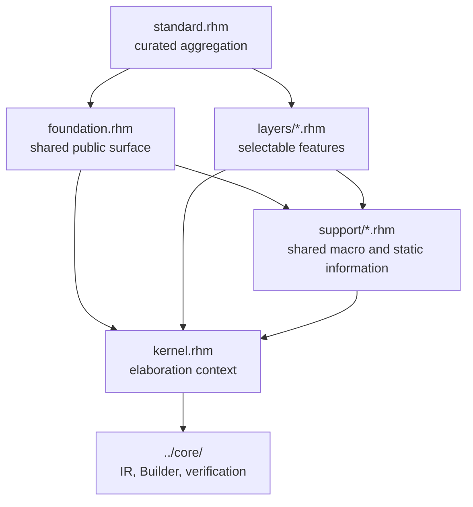

<!-- Explains the Rhodium frontend implementation, extension workflow, and focused validation. -->
<!-- SPDX-License-Identifier: Apache-2.0 -->

# Developing the Rhodium frontend

Read the [frontend guide](README.md) first for the public contracts of language
profiles, elaboration, circuit parameters, hierarchy, and extension routing.
The [layer reference](layers/README.md) owns author-visible feature semantics;
this document owns the machinery and contributor workflow behind those
contracts.

## Architecture and ownership

The frontend is a staged authoring system over the public core IR. It must not
introduce an alternate hardware representation or depend on a backend.



| Location | Implementation responsibility |
|---|---|
| [`kernel.rhm`](kernel.rhm) | Own the active elaboration context, module specialization, deferred values, construction calls into the core Builder, conditional effect collection, and final verification |
| [`foundation.rhm`](foundation.rhm) | Export the common authoring surface: circuits, ports, connection, elaboration entry points, base hardware annotations, and public extension protocols |
| [`support/`](support/) | Share non-profile macro and static-information machinery across the foundation and independent layers |
| [`layers/`](layers/DEVELOPING.md) | Implement independently selectable authoring features over existing semantics |
| [`standard.rhm`](standard.rhm) | Aggregate the foundation and curated layers without defining feature behavior |
| [`../language.rhm`](../language.rhm) and [`../base/language.rhm`](../base/language.rhm) | Compose the standard and base `#lang` profiles |

The authoritative package boundaries and direct-dependency inventories live in
the [Rhodium contributor guide](../DEVELOPING.md). In particular, frontend code
must not import backends or the optional standard library, the foundation must
not import layers, support must not import profiles or layers, and layers must
not import one another.

## Elaboration lifecycle

`foundation.rhm` expands a circuit declaration into a stable
`CircuitIdentity`, normalized generator parameters, and a call to
`kernel.build_circuit`. A top-level `elaborate` or `elaborate_with_top` call then
uses the following lifecycle:

1. `frontend_elaboration` creates one core `Design`, `Builder`, and
   `FrontendContext`.
2. `build_circuit` rejects live circuit-bound hardware parameters, resolves or
   creates the selected module definition, and establishes the active module.
3. Layer and foundation forms call kernel operations, which materialize inputs
   through `kernel.read` and delegate construction to the core Builder.
4. Circuit finalizers resolve source-order-independent work and accumulated
   vector-register writes before the Builder finishes the module.
5. The top result is normalized through `CircuitDefinition` when a frontend
   wrapper carries metadata, and core `verify_design` checks the completed
   design.

Keep frontend checks close to the authoring construct when they diagnose syntax,
static information, or an elaboration-time contract. Put representation-wide
invariants in the core verifier so every frontend and direct Builder client is
checked.

## Specialization and cache safety

`FrontendContext.specializations_by_circuit` is local to one elaboration and is
keyed first by declaration identity. `build_circuit` reuses a definition only
when every normalized positional and keyword argument is stable:

- scalar immutable host values and recursively stable immutable lists compare
  by value;
- hardware type descriptors compare with `type_equal`;
- `StableCircuitParam` values use a symmetric call to
  `same_stable_circuit_param`;
- other host values are legal but deliberately bypass reuse.

Do not broaden the stable set to mutable collections, functions, or closures.
A cache hit skips the circuit body, so admitting a value whose equality can
change would make elaboration depend on call order. `build_circuit` also tracks
active declaration identities to reject recursive elaboration before a partial
module escapes.

When changing generator binding syntax, update parameter normalization in
[`support/generator-parameters.rhm`](support/generator-parameters.rhm) and test
positional arguments, keywords, defaults, dependent annotations, stable reuse,
uncached calls, and live-hardware rejection together.

## Deferred values and static information

The kernel distinguishes live hardware from deferred frontend descriptions:

- `DeferredHardwareValue` materializes when `kernel.read` needs a core value.
- `StaticHardwareValue` marks an immutable description that may safely cross a
  generator-parameter boundary.
- `RegisterPathValue` delays the choice between a register's current value and
  its next-state place until read or drive context is known.
- `CircuitDefinition` lets wrappers retain frontend-only metadata while exposing
  an ordinary core module to instantiation and top selection.

[`support/hardware-literal.rhm`](support/hardware-literal.rhm) implements the
public `HardwareLiteral` protocol on that deferred boundary. Field, annotation,
method, and producer-specific surfaces are carried by Rhombus static
information in [`support/fields.rhm`](support/fields.rhm), not by frontend-only
IR operations. See the [layer contributor guide](layers/DEVELOPING.md) before
changing those keys or providers; their propagation is shared by ports,
instances, aggregates, muxes, casts, and state.

## Making a frontend change

First use the [public extension-routing table](README.md#extension-routing) to
confirm that the change belongs in the frontend. Then preserve these seams:

1. Put behavior required by both language profiles in `foundation.rhm` only
   when it is truly part of the minimal public surface.
2. Put independently selectable notation or policy in one file under
   `layers/`; use the [layer workflow](layers/DEVELOPING.md#adding-or-changing-a-layer).
3. Put shared expansion or static-information machinery in `support/` only
   after at least two frontend clients require the same mechanism.
4. Keep semantic construction in the kernel thin: validate frontend entities,
   materialize them, and call the public core Builder.
5. Add a core operation only when the behavior cannot be represented faithfully
   by existing core semantics; update core verification and all consumers in
   that change.
6. Export a curated feature from `standard.rhm`; do not implement it there.
7. Document author-visible behavior in `README.md` or
   [`layers/README.md`](layers/README.md), and implementation details here or in
   [`layers/DEVELOPING.md`](layers/DEVELOPING.md).

## Implementation map

| Concern | Primary implementation | Focused coverage |
|---|---|---|
| Profiles and common circuit forms | [`foundation.rhm`](foundation.rhm), [`standard.rhm`](standard.rhm), [`../language.rhm`](../language.rhm), [`../base/language.rhm`](../base/language.rhm) | [`tests/frontend-test.rhm`](tests/frontend-test.rhm), [`tests/lop-equivalence-test.rhm`](tests/lop-equivalence-test.rhm) |
| Elaboration context and construction | [`kernel.rhm`](kernel.rhm) | [`../../rhodium/frontend/tests/ir-test.rhm`](../../rhodium/frontend/tests/ir-test.rhm), [`../../rhodium/frontend/tests/elaboration-result-test.rhm`](../../rhodium/frontend/tests/elaboration-result-test.rhm) |
| Generator parameters and specialization | [`kernel.rhm`](kernel.rhm), [`support/generator-parameters.rhm`](support/generator-parameters.rhm) | [`../../rhodium/frontend/tests/circuit-param-test.rhm`](../../rhodium/frontend/tests/circuit-param-test.rhm), [`../../rhodium/frontend/tests/generator-parameters-test.rhm`](../../rhodium/frontend/tests/generator-parameters-test.rhm), [`../../rhodium/frontend/tests/nested-circuit-test.rhm`](../../rhodium/frontend/tests/nested-circuit-test.rhm) |
| Hardware annotations, fields, and methods | [`support/fields.rhm`](support/fields.rhm), [`support/hardware-types.rhm`](support/hardware-types.rhm), [`support/hardware-methods.rhm`](support/hardware-methods.rhm) | [`../../rhodium/frontend/tests/hardware-annotation-test.rhm`](../../rhodium/frontend/tests/hardware-annotation-test.rhm), [`../../rhodium/frontend/tests/width-method-test.rhm`](../../rhodium/frontend/tests/width-method-test.rhm), [`../../rhodium/frontend/tests/into-test.rhm`](../../rhodium/frontend/tests/into-test.rhm) |
| Deferred literal descriptions | [`support/hardware-literal.rhm`](support/hardware-literal.rhm) | [`../../rhodium/frontend/tests/hardware-literal-test.rhm`](../../rhodium/frontend/tests/hardware-literal-test.rhm), [`../../rhodium/std/tests/dont-care-test.rhm`](../../rhodium/std/tests/dont-care-test.rhm) |
| Invalid profile and construction uses | Language readers, foundation, kernel, and layers | [`tests/invalid/`](tests/invalid/), [`tests/run-negative-cases.rktd`](tests/run-negative-cases.rktd) |

## Validation

Run checks from the repository root. `tools/run-racket-tests.sh` selects the
persistent worktree-specific `PLTCOMPILEDROOTS` when none is supplied.

For a narrow change, run the directly affected positive tests and any matching
negative cases. For example:

```sh
tools/run-racket-tests.sh \
  rhodium/frontend/tests/circuit-param-test.rhm \
  rhodium/frontend/tests/generator-parameters-test.rhm
bash rhodium/frontend/tests/run-negative.sh
```

Also run:

- `make check-boundaries` after changing imports, package placement, or profile
  composition;
- `make lop-test` after changing the foundation, standard aggregation, or a
  profile reader;
- `make frontend-test` when shared kernel, support, or layer machinery changes
  broadly.

If a frontend change alters the core operations or types produced by existing
programs, run the focused backend fixture that lowers that behavior as well.
Do not infer backend correctness from host elaboration tests alone.

## Layered semantic retention

`kernel.rhm` owns the per-elaboration `~semantics` option and the
`semantic_expansion` / `record_semantics` hooks. A dynamic collector retains
nested expansion nodes only within the same module; child module definitions
keep their own roots. No global mode or consumer import participates in macro
expansion. Descriptions run after ordinary expansion so they bind actual core
objects; only the retained documentation is optional.

`layers/interface.rhm` uses the generic hook to export declared transform
endpoints and configuration to core-owned records. Keep protocol-specific trace
models in the interface layer and do not reconstruct behavior from display
names. Field bindings use aggregate paths instead of elaborating projections.

`tests/semantic-expansion-test.rhm` compares ordinary IR and emitted CIRCT in
both modes, exercises a custom nested macro, and checks an existing flow queue.
Run it with `core/tests/semantic-node-test.rhm` (relative to `rhodium/`) when
changing this boundary. Existing frontend and profile suites cover the shared
kernel and elaboration macro surface.

## Deferred executable constructs

The foundation's `implementation(~construct: declaration)` form captures an
implementation thunk after ordinary signature declarations. Kernel
`construct_signature` reads the declared core ports; `construct_implementation`
checks the boundary and either executes the thunk or uses
`Builder.construct_apply` to supply all declared outputs. No simulator import,
global mode, or separately compiled macro profile participates in this choice.
`frontend_elaboration` isolates the current module as well as its context.

Run the construct-elaboration and construct-syntax tests, then frontend/profile
coverage for this shared boundary. Flow's retained-queue test checks the real
library declaration and provider; the backend construct-elaboration test checks
expanded emission and unresolved-input diagnostics.

The interface layer and sync support implement the core metadata remapping
protocol. Interface endpoint identity links event annotations to transforms;
use the mapper's memoization when rebuilding these records. Trace controls
owned by a child must use that instance's mapping scope. Immutable protocol
and direction descriptors remain shared. Event materialization tests cover
these contracts without a reverse dependency on the event package.

`kernel.payload_expansion` normalizes arguments before recording the operation
scope, invokes the payload callback once, and delegates retained-mode extraction
to core. `foundation.rhm` exports this extension hook. Test it with
`tests/payload-expansion-test.rhm`: ordinary and retained hardware must match,
while retained captures reference the original module's live values. Keep
transport identities and protocol policy in their owning library.

`kernel.apply_construct` adapts inline hardware operands to Builder's retained
operation API. Its name allocation covers both ordinary and retained instances;
keep this operation-level path separate from whole-module signature declarations.
`foundation.rhm` exposes this hook and composition records for library providers.
Chained retained maps exercise name disambiguation and portable composition wiring.
