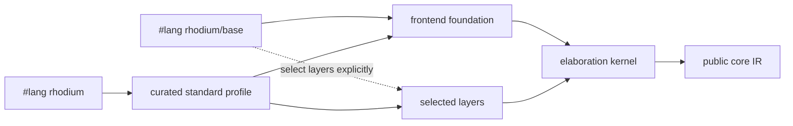

<!-- Documents Rhodium elaboration, public language profiles, and frontend extension boundaries. -->
<!-- SPDX-License-Identifier: Apache-2.0 -->

# Rhodium frontend

The frontend turns ordinary Rhombus computation and Rhodium notation into the
single public core IR. Macro expansion is not a second hardware IR. The public
package map is in [`../README.md`](../README.md); individual language features
are documented in [`layers/README.md`](layers/README.md). Contributors changing
the frontend should also read [`DEVELOPING.md`](DEVELOPING.md), while the
implementation dependency contract and authoritative layer inventory live in
[`../DEVELOPING.md`](../DEVELOPING.md).

This guide answers four frontend questions: which profile to use, what
elaboration does, where host computation ends and hardware begins, and where a
new abstraction belongs.

## Choose a language profile

Both profiles elaborate through the same kernel into the same core IR.
`#lang rhodium` is the normal choice; use `#lang rhodium/base` when a tool,
experiment, or library needs an explicitly minimal language surface.



| Profile | Includes | Use it for |
|---|---|---|
| `#lang rhodium` | Foundation and all curated layers | Designs, reusable hardware libraries, and most tests |
| `#lang rhodium/base` | Foundation only; layers are explicit imports | Layer isolation, language experiments, and minimal tooling fixtures |

The base profile exposes `circuit`, `elaborate`, ports, `<==`, `Bits`, `Clock`,
`Reset`, hardware selection, `.into`, and guarded host `if`. It does not expose
the public core Builder or raw kernel. For example, an adder can select only the
combinational layer:

```rhombus
#lang rhodium/base

import:
  lib("rhodium/frontend/layers/comb.rhm") open

circuit Adder(width):
  input(a, b): Bits(width)
  output sum: Bits(width)
  sum <== a + b

def design = elaborate(Adder(8))
```

The standard profile adds the curated layers without changing the resulting
IR. The four programs under [`../../examples/lop/`](../../examples/lop/)
express one adder through the public core, kernel, explicit base composition,
and standard profile. `make lop-test` checks that all four produce identical
public IR and CIRCT representations.

Library code may use `hardware_value_type(value)` to recover the Rhodium type of
caller-elaborated readable or driveable hardware without importing core IR
classes. Host values are rejected.

## Circuits and elaboration

Elaboration is deterministic host computation that constructs known-width
hardware:

1. A circuit call selects a module specialization from host parameters.
2. The circuit body constructs ports, operations, state, instances, and drives.
3. Stable equivalent calls reuse the same module definition.
4. `elaborate` returns a core `Design`; `elaborate_with_top` also identifies its
   explicit top module.

### Circuit families and explicit tops

A circuit declaration defines a parameterized module family. Calling it while
elaborating creates the selected specialization once and reuses that definition
for later calls with the same stable parameters:

```rhombus
circuit Passthrough(T):
  input source: T
  output result: T
  result <== source

def design = elaborate(Passthrough(Bits(8)))
```

Consumers that need a stable explicit top, such as RFPL physical annotation,
use `elaborate_with_top`:

```rhombus
def logical = elaborate_with_top(Passthrough(Bits(8)))
def design = logical.design
def top = logical.top
```

`elaborate` remains the concise compatibility form returning a bare `Design`.
`Module.find_instance(name)` provides stable direct-instance inspection; tools
must not infer the top or hierarchy from module-list positions.

The [`layers/clocking.rhm`](layers/clocking.rhm) layer builds on that explicit-
top seam and is included in the standard profile. Its
`elaborate_with_clocking` wrapper collects temporal environment declarations
from the root circuit, validates them after ordinary elaboration, and returns
the unchanged design together with its resolved clocking report.
`elaborate_with_cdc` additionally rejects unsafe clock-domain sampling unless
the first destination register carries structurally verified crossing
evidence.

### Ports and drivers

Inputs are readable and cannot be driven. Outputs are driveable and become
readable after they are driven. Outputs, instance inputs, and register
next-state places use `<==`; every place has one effective driver.

Grouped ports share one explicit type:

```rhombus
input(a, b): Bits(width)
output(sum, carry): Bits(width)
```

### Host control versus hardware control

Host values determine which hardware exists. They are not runtime hardware
data:

| Host-side construct | Elaboration meaning | Hardware-side counterpart |
|---|---|---|
| `Int` | A number used while constructing hardware | `Bits(width)` stores a runtime bit vector |
| `Boolean` | A host-only truth value | `Bool` stores a runtime Boolean value |
| `if` | Select which structure to construct | `when` conditionally drives hardware |
| Host lookup or branching | Select a case while elaborating | `switch` selects an exact hardware key at runtime |
| `for` over a host collection | Repeat generated structure | The resulting operations and instances |
| Circuit generator call | Select or create a module specialization | An instance of that module |

Host control retains ordinary Rhombus truthiness. A hardware value is a host
object and is therefore truthy, so using one wherever Rhombus asks for a truth
value—including `if`, `unless`, `cond`, host Boolean operators, and iteration
guards—tests the presence of that object; it never observes the value carried
by hardware at runtime. Use the hardware-only `when` and `switch` forms supplied
by the conditional layer for runtime control. `when` conditions must be one-bit
hardware values; `switch` selectors must be hardware values with supported
exact keys. Host values are rejected by both forms.

## Module specialization and host helpers

Circuit parameters may be any host value; only live circuit-bound hardware is
rejected. Their stability determines specialization reuse:

| Parameter kind | Specialization behavior |
|---|---|
| Integers, Booleans, strings, symbols, recursively stable immutable lists, and hardware-type descriptors | Equivalent values reuse one module definition |
| An immutable class implementing `StableCircuitParam` | Uses Rhombus `==` by default; transparent classes compare structurally and opaque artifacts remain nominal |
| Mutable collections, functions, closures, and other host objects | Legal, but every call creates a fresh module definition |

A configuration opts into stable reuse explicitly:

```rhombus
class EngineConfig(lanes :: PosInt, width :: PosInt):
  implements StableCircuitParam
```

Override `same_stable_circuit_param` only for equality semantics different from
`==`; the result must be symmetric, deterministic, and independent of mutable
elaboration state.

Generator declarations accept positional and keyword bindings with ordinary
Rhombus annotations and default expressions. Ordinary and sync circuits share
these parameter forms and host-value validation.

Within one elaboration, calls with stable equivalent arguments reuse one module
definition. Distinct or non-reusable calls receive deterministic suffixes such
as `Adder` and `Adder_1`; parameters are not embedded in names. Active recursive
calls to the same generator are rejected. The implementation of specialization
identity, comparison, and caching is described in
[`DEVELOPING.md`](DEVELOPING.md#specialization-and-cache-safety).

### Determinism and cache safety

Circuit bodies and parameter defaults must depend only on their parameters,
stable immutable captures, and local elaboration state. Local mutation used to
collect generated structure is valid; observing or modifying external mutable
state is not, because a cache hit does not execute the body again. A physical
or implementation variant that needs a distinct definition should carry an
explicit stable parameter naming that variant.

### Hardware-aware host helpers

Ordinary host functions may accept hardware objects while elaborating,
inspect type descriptors, construct hardware, and return hardware to the
enclosing circuit. This is different from passing runtime hardware as a
circuit generator parameter:

```rhombus
fun low_word(value, width) :: Bits(width):
  value[0..width]
```

Annotate a type parameter as `T :: DataType` and a runtime value with the most
specific hardware annotation the operation accepts. Exact annotations retain
field, indexing, casting, and lookup information. A
`hardware_type Token(width)` declaration provides exact `Token(width)` and
family-wide `Token`; `value.type` recovers the concrete descriptor. Use
`Hardware.of(type)` for a dynamic descriptor, bare `Bits` for any bit-vector
width, `Hardware.packable` for any packed `DataType`, and bare `Hardware` only
for arbitrary readable or driveable hardware entities.

See [`../../examples/rtl/host-parameters.rhdl`](../../examples/rtl/host-parameters.rhdl)
and [`../../examples/rtl/layered-adder.rhdl`](../../examples/rtl/layered-adder.rhdl).

## Nested circuits and hierarchy

A circuit body may declare a private child generator that captures stable host
values, including parameters of the enclosing generator:

```rhombus
circuit Incrementer(width):
  input value_in: Bits(width)
  output value_out: Bits(width)

  circuit Increment():
    input value_in: Bits(width)
    output value_out: Bits(width)
    value_out <== value_in + bits(1, width)

  inst increment(Increment())
  increment.value_in <== value_in
  value_out <== increment.value_out
```

Calling the nested generator still materializes a separate module. Only host
values may be captured; parent hardware crosses the child boundary through
ports. An unused nested declaration emits no module.

A nested `sync_circuit` follows the same domain rules as any other synchronous
child. A sync parent propagates its ambient clock and reset only to marked sync
children; ordinary children never inherit a domain by port name or type. The
physical `clock` and `reset` ports are not source bindings in a `sync_circuit`
body. Use `reset_when(condition)` for a nested reset scope or an instance's
`~reset_when: condition` option to derive a child reset from the ambient one.
Explicit `~clock` and `~reset` controls remain available only outside an active
sync domain.

See [`../../examples/rtl/nested-circuit.rhdl`](../../examples/rtl/nested-circuit.rhdl)
and the integrated host-specialization example
[`../../examples/rtl/tiny-simd.rhdl`](../../examples/rtl/tiny-simd.rhdl).

## Deferred host descriptions

The kernel supports deferred frontend values so layers can retain authoring
metadata until a hardware operation consumes it. Static literal shadows,
enum members, and other reusable host descriptions do not allocate IR merely
by being declared or passed as circuit parameters. Once consumed, they lower
to ordinary core values and operations.

Every `HardwareLiteral` reports its hardware type, packed width, and packed
host value. Ordinary public-surface libraries can therefore build typed static
abstractions—such as [`../std/decode/pattern.rhdl`](../std/decode/pattern.rhdl)—
without importing core or frontend implementation modules.

The static subtype distinguishes reusable descriptions from objects already
owned by an elaborated circuit. This is how extensions add types, literal
forms, mux keys, field access, and annotations without adding frontend-only
operations to the core IR.

## Extension routing

Start with the narrowest boundary that can express the abstraction. The
authoritative import rules remain in the
[package dependency contract](../DEVELOPING.md#dependency-rules).

| The change needs to... | Put it in... | Boundary |
|---|---|---|
| Compose existing hardware operations behind a reusable API | An ordinary Rhombus or Rhodium library | Use only public language forms |
| Add notation, static information, or authoring policy over existing semantics | `frontend/layers/` | A selectable layer; do not import sibling layers |
| Share macro or static-information machinery across layers | `frontend/support/` | Not a selectable profile and not feature behavior |
| Derive certification, provenance, or diagnostics from completed IR | `rhodium/analysis/` | Consume core IR without becoming core semantics |
| Add hardware semantics that verification and every backend must preserve | `rhodium/core/` | Extend the IR, Builder, verifier, printer, and consumers together |
| Lower an existing core operation to a target | `rhodium/backend/` | Consume core IR; never import frontend implementation |

A useful construction abstraction can be an ordinary Rhombus function:

```rhombus
#lang rhombus

import:
  lib("rhodium/frontend/layers/comb.rhm") open

fun add_pair(left, right):
  left + right
```

Importing this function from a `.rhdl` program requires no reader, IR,
verifier, or backend change. For frontend implementation roles, see the
[frontend contributor guide](DEVELOPING.md); for the existing public features,
see the [layer reference](layers/README.md).

## Retaining expansion semantics

Normal elaboration runs the common hardware expansion. A consumer that also
needs high-level intent can request retained expansion nodes:

```rhombus
def elaboration = elaborate_with_top(Top(), ~semantics: #true)
```

`elaborate` accepts the same option. The option belongs to one elaboration, so
ordinary and retaining consumers can reuse the same already-expanded Rhombus
circuit code without sharing designs or changing specialization identity.

Extension macros can expand to the kernel's
`semantic_expansion(kind, expand, describe)` hook. `expand` is a zero-argument
function that constructs the ordinary hardware and returns its usual result.
`describe(result)` returns a core `SemanticDescription`. In ordinary mode the
hook calls only `expand`. In retaining mode it also records the description,
nested expansion nodes, and the local operations constructed by `expand`.
Both modes execute the hardware expansion exactly once.

Description callbacks must only inspect existing hardware; they must not
construct hardware or change the design. `record_semantics(kind, describe)`
is the equivalent hook for documenting already-constructed structures.
These are elaboration-time hooks emitted by macros, not a second invocation of
the Rhombus syntax expander and not a simulator dependency in the frontend.

Existing `describe_interface_transform` calls retain `flow.<kind>` nodes in
this mode. Their bindings preserve endpoint fields and types; properties record
endpoint roles, protocol ancestry, declared routes, declared latency, and transform
configuration. Explicit combinational transfer guards and fixed-latency flush
controls are retained as bindings.
An implementing instance is retained as a core operation reference. Protocol
names and transform kinds document intent and do not alone authorize behavioral
substitution. Detailed interface trace models remain in their owning interface
metadata; this export does not invent acceptance equations or infer missing
contracts.

Consumers read the completed tree through the
[core semantic-node API](../core/README.md#retained-expansion-semantics).
CIRCT emission uses the same ordinary graph in either mode.

## Deferred construct implementations

A circuit can declare its signature before supplying a portable body:

```rhombus
def AddConstruct = ConstructIdentity("example.add", 1)
circuit Add():
  input(a, b): Bits(8)
  output sum: Bits(8)
  def declaration = construct_signature(
    AddConstruct, {}, fun (output): [PortLeaf("a"), PortLeaf("b")])
  implementation(~construct: declaration):
    sum <== a + b
```

`construct_signature` obtains the typed ports already declared in the current
circuit and calls the required dependency function for each output leaf. Supply
`~clocks`, `~resets`, and `~effects` for stateful meanings; these are core
`ConstructReset` and `ConstructEffect` records. Port and interface declarations
may precede the implementation block; hardware computations must be inside it.
The block must supply the implementation of the whole declared boundary.

Default elaboration executes this body. `elaborate_with_top(Top(), ~constructs:
#true)` retains `construct.apply` nodes without executing their bodies; plain
`elaborate` accepts the same option. Interface types and frontend member
metadata survive retention. The option is local to one elaboration and can be
combined with `~semantics`. Ordinary Rhombus specialization still runs, and
module specializations remain shared within that elaboration.

Libraries export an `ExpansionProvider` separately from their nominal identity.
The provider returns a lower-level construct/composition or a verified core
implementation. `bind_core_implementation` is available through the public
language to bind expanded RTL's effects to the declaration. Consumers use the
[core selection API](../core/README.md#constructs-inside-module-dfgs) with their
own registrations. Standard CIRCT emission currently consumes expanded module
IR; it diagnoses an unresolved `construct.apply` rather than omitting it.

## Payload expansion hook

Library extensions can call `payload_expansion(arguments, expand)` with hardware
arguments and a zero-argument callback returning hardware data. The callback
executes once. The result has `value`, the ordinary hardware result, and
`captured`, which is false during ordinary elaboration. With `~constructs: #true`,
`captured` is a core `CapturedPayload` with an independent typed region and live
source bindings. See the [core payload contract](../core/README.md#payload-computation-regions).

This hook extracts computation; it does not insert a retained transport construct
or change the result's wiring. A library can use
`apply_construct(specialization, inputs, ~name: "construct")` to emit a retained
operation and receive its result values. Inputs follow the contract's input-port
order; names are disambiguated against existing instances and retained operations.
The public language also exposes the core composition records for portable
providers. Flow's [retained map](../../flow/README.md#retained-payload-mapping)
combines these extension APIs.
